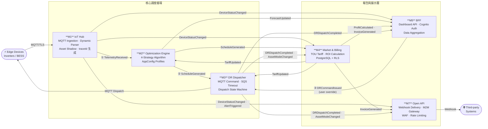
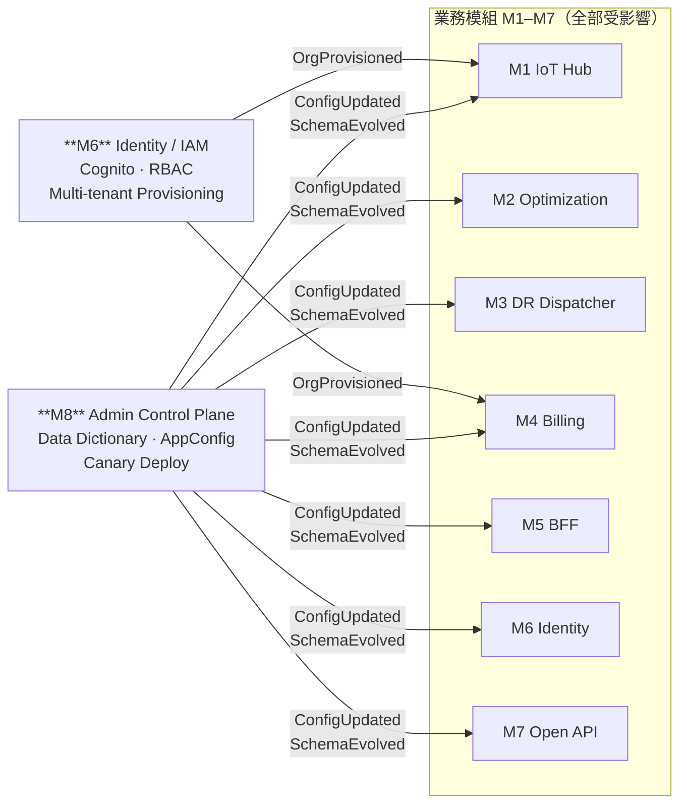

# SOLFACIL VPP — Master Architecture Blueprint

> **模組版本**: v5.2
> **最後更新**: 2026-02-27
> **說明**: 系統總控藍圖 — 文件索引、系統定位、8大模組邊界、事件流、架構決策

---

## 文件索引表

| # | 文件名 | 路徑 | 說明 |
|---|--------|------|------|
| 00 | **MASTER_ARCHITECTURE** | `00_MASTER_ARCHITECTURE_v5.2.md` | 系統總控藍圖（本文件） |
| 01 | **SHARED_LAYER** | [09_SHARED_LAYER_v5.3.md](./09_SHARED_LAYER_v5.3.md) | 公共型別定義、API 契約、EventSchema、目錄結構 |
| 02 | **BFF_MODULE (M5)** | [05_BFF_MODULE_v5.3.md](./05_BFF_MODULE_v5.3.md) | Frontend BFF — 聚合 API、Cognito 授權、中間件鏈 |
| 03 | **IOT_HUB_MODULE (M1)** | [01_IOT_HUB_MODULE_v5.3.md](./01_IOT_HUB_MODULE_v5.3.md) | IoT Hub — MQTT 接入、動態解析器、Asset Shadow |
| 04 | **ADMIN_CONTROL_MODULE (M8)** | [08_ADMIN_CONTROL_MODULE_v5.3.md](./08_ADMIN_CONTROL_MODULE_v5.3.md) | Admin Control Plane — 全局控制面、Data Dictionary、AppConfig |
| 05 | **DR_DISPATCHER_MODULE (M3)** | [03_DR_DISPATCHER_MODULE_v5.2.md](./03_DR_DISPATCHER_MODULE_v5.2.md) | DR Dispatcher — 調度指令、SQS 逾時、狀態追蹤 |
| 06 | **OPTIMIZATION_ENGINE_MODULE (M2)** | [02_OPTIMIZATION_ENGINE_MODULE_v5.2.md](./02_OPTIMIZATION_ENGINE_MODULE_v5.2.md) | Optimization Engine — 4 種策略演算法、排程最佳化 |
| 07 | **MARKET_BILLING_MODULE (M4)** | [04_MARKET_BILLING_MODULE_v5.2.md](./04_MARKET_BILLING_MODULE_v5.2.md) | Market & Billing — 電價計費、收益計算、PostgreSQL schema |
| 08 | **OPEN_API_MODULE (M7)** | [07_OPEN_API_MODULE_v5.2.md](./07_OPEN_API_MODULE_v5.2.md) | Open API — M2M Gateway、Webhook、WAF、Rate Limiting |
| 09 | **IDENTITY_MODULE (M6)** | [06_IDENTITY_MODULE_v5.2.md](./06_IDENTITY_MODULE_v5.2.md) | Identity — Cognito、Multi-tenant、RBAC、SSO Federation |

---

## 1. 系統定位

SOLFACIL is building a **B2B SaaS Virtual Power Plant (VPP)** platform that aggregates distributed battery energy storage systems (BESS) across Brazil. The platform enables:

- **Tarifa Branca arbitrage** — Charge batteries during off-peak hours, discharge during peak hours to maximize the R$ 0.57/kWh spread
- **Demand Response (DR)** — Coordinated dispatch of 50,000+ battery assets for grid balancing events
- **Multi-tenant management** — Multiple enterprise clients with strict data isolation (`org_id` first-class citizen)
- **External integration** — M2M API access for ERP systems, trading platforms; event-driven webhooks

### Technology Stack

| Layer | Technology | Version |
|-------|-----------|---------|
| IaC | AWS CDK (TypeScript) | v2.x |
| Compute | AWS Lambda | Node.js 20 / Python 3.12 (M2 only) |
| API | API Gateway v2 (HTTP API) | — |
| Auth | Amazon Cognito | User Pool + Identity Providers |
| Messaging | Amazon EventBridge | Custom bus |
| IoT | AWS IoT Core | MQTT v4.1.1 over TLS |
| Time-series | Amazon Timestream | — |
| Key-value | Amazon DynamoDB | On-demand |
| Queue | Amazon SQS | Standard + Delay |
| Config | AWS AppConfig + Lambda Extension | Sidecar pattern |
| Security | AWS WAF v2, Secrets Manager | — |
| Observability | Lambda Powertools, X-Ray, CloudWatch | — |

### Core Design Principles

| # | Principle | Rationale |
|---|-----------|-----------|
| 1 | **Multi-tenant by design** | `org_id` is a mandatory dimension in every data store, event payload, MQTT topic, and API response |
| 2 | **Event-driven decoupling** | All inter-module communication flows through a single Amazon EventBridge bus (`solfacil-vpp-events`). No direct Lambda-to-Lambda invocations |
| 3 | **Bounded contexts** | Each module owns its data store. No shared databases. Cross-module data access mediated by events or BFF aggregation |
| 4 | **Serverless-first** | Zero server management. Lambda + DynamoDB/Timestream/RDS Serverless. Pay-per-invocation |
| 5 | **API-first** | BFF (M5) for dashboard, Open API (M7) for external integrations. Both documented and versioned independently |
| 6 | **Zero-trust security** | Every request authenticated. Every query tenant-scoped. Every write role-checked |
| 7 | **Immutability** | All state changes produce events. Lambda handlers return new objects, never mutate in place |

---

## 2. 最高架構憲法：接口契約鎖定與變更法則 (API Contract Governance)

> ⚖️ **本章節具有最高優先級。所有模組開發者在動任何接口定義之前，必須先閱讀並遵守以下兩條鐵律。**

微服務模組之間的數據傳遞，必須視同**實體硬體的物理接口（PCB 腳位）**。接頭與插座一旦量產出廠，任何單方面的改動都將導致整個電路板短路崩潰。本系統採用相同原則對待所有 API 契約。

---

### ⚙️ 鐵律一：向下相容的「擴充許可」(Open for Extension, Closed for Modification)

所有模組的輸入規格（Request Schema）與輸出規格（Response / Event Payload），均定義於 [`09_SHARED_LAYER_v5.2.md`](./09_SHARED_LAYER_v5.2.md)，一旦版本發佈，視同**鎖死的硬體腳位**，不得單方面修改。

| 操作 | 允許與否 | 說明 |
|------|---------|------|
| ✅ 新增選填欄位 | **允許** | 等同多焊幾個新腳位，舊模組忽略新欄位，不受影響 |
| ✅ 新增必填欄位（含 default 值） | **允許（有條件）** | 必須確保所有現有呼叫方均提供 default 值，不可靜默失敗 |
| ❌ 重新命名既有欄位 | **嚴格禁止** | 相當於更改腳位定義，所有下游模組立即讀到空值或型別錯誤 |
| ❌ 改變欄位資料型態 | **嚴格禁止** | 例如 `bat_soc: number` 改為 `bat_soc: string`，下游運算立即崩潰 |
| ❌ 刪除既有欄位 | **嚴格禁止** | 下游依賴該欄位的模組將讀到 `undefined`，引發靜默 bug |
| ❌ 改變事件的 `detail-type` 字串 | **嚴格禁止** | EventBridge 訂閱規則基於此字串，改動導致事件無法路由，模組靜默失聯 |

**根本原則**：對既有接口，只可加，不可改，不可刪。

---

### 🔗 鐵律二：破壞性變更的「連鎖升級法」(Cascading Updates)

若因業務不可抗力，確實必須執行上表中「嚴格禁止」的 Breaking Change，須嚴格遵守以下流程，**嚴禁單模組偷偷修改**：

#### 步驟一：影響範圍盤點

修改者須查閱本文件 **§3 EventBus 核心事件流** 與各模組文件的「模組依賴關係」段落，列出所有直接或間接依賴該接口的上下游模組。

例如，若修改 `AssetRecord`（M1 產出，定義於 Shared Layer）：

```
影響範圍：
  直接下游 → M2 (Optimization Engine) 讀取 AssetRecord 觸發演算
  直接下游 → M3 (DR Dispatcher) 讀取 AssetRecord 產生調度指令
  間接下游 → M5 (BFF) 彙總 AssetRecord 回傳 Dashboard
  間接下游 → M4 (Billing) 讀取 AssetRecord 計費
```

#### 步驟二：同步升版（Synchronized Version Bump）

所有受影響的模組**必須同步升級版本號**，確保「接頭與插座」同時替換，不留下版本不一致的夾縫地帶。

```
正確做法（示例）：Breaking Change 導致 v5.2 → v6.0
  ✅ Shared Layer    : v5.2 → v6.0
  ✅ M1 (IoT Hub)    : v5.2 → v6.0  （修改來源）
  ✅ M2 (Engine)     : v5.2 → v6.0  （直接依賴）
  ✅ M3 (Dispatcher) : v5.2 → v6.0  （直接依賴）
  ✅ M4 (Billing)    : v5.2 → v6.0  （間接依賴）
  ✅ M5 (BFF)        : v5.2 → v6.0  （間接依賴）
  
  ❌ 錯誤做法：只升級 M1，讓 M2/M3 繼續使用 v5.2 接口
     → 系統在執行時而非編譯時才爆炸，且難以追蹤根因
```

#### 步驟三：更新模組版本矩陣

完成連鎖升版後，**必須更新本文件（§ 模組版本矩陣）中所有受影響模組的版本號**，確保矩陣始終反映系統的真實狀態，作為下次 Breaking Change 的基準。

---

> 📌 **記住**：微服務架構的最大優勢是模組獨立演進。但這個優勢的前提，是接口契約的嚴格不變性。破壞接口契約，不是修改了一個模組，而是同時破壞了所有依賴它的模組——只是它們不會立刻告訴你。

---

## 3. 8 大模組邊界與職責

### Module Responsibility Matrix

| Plane | Module ID | Name | Responsibility | Primary Data Store | Key Technology |
|-------|-----------|------|----------------|--------------------|----------------|
| **Control** | M8 | Admin Control Plane | Dynamic configuration, business rules, feature flags, Global Data Dictionary | DynamoDB + AppConfig | Lambda + DynamoDB + AppConfig |
| Data | M1 | IoT & Telemetry Hub | MQTT ingestion, dynamic parser, Device Shadow, telemetry storage | Amazon Timestream | Lambda + IoT Core + DynamoDB |
| Data | M2 | Optimization Engine | Schedule optimization, forecast, Tarifa Branca arbitrage | SSM Parameter Store | Lambda + AppConfig |
| Data | M3 | DR Dispatcher | Demand-response commands, SQS timeout, status tracking | DynamoDB | Lambda + EventBridge + MQTT |
| Data | M4 | Market & Billing | Tarifa Branca rules, profit calculation, invoicing | RDS PostgreSQL | Lambda + DynamoDB |
| Data | M5 | Frontend BFF | Dashboard REST API (Cognito-protected, tenant-scoped) | Aggregates from M1-M4 | Lambda + API Gateway |
| Data | M6 | Identity & Tenant (IAM) | Cognito User Pool, SSO/SAML, org provisioning, RBAC | Cognito + DynamoDB | Lambda + Cognito |
| Data | M7 | Open API & Integration | M2M API Gateway, WAF, rate limiting, webhook subscriptions | DynamoDB + Secrets Manager | Lambda + API Gateway |

### 模組版本號矩陣

| 模組 ID | 模組名稱 | 當前版本 | 文件 | 主要技術 |
|---------|---------|---------|------|---------|
| M1 | IoT Hub | **v5.3** | [03_IOT_HUB](./01_IOT_HUB_MODULE_v5.3.md) | Lambda + IoT Core + DynamoDB |
| M2 | Optimization Engine | v5.2 | [06_OPTIMIZATION_ENGINE](./02_OPTIMIZATION_ENGINE_MODULE_v5.2.md) | Lambda + AppConfig |
| M3 | DR Dispatcher | v5.2 | [05_DR_DISPATCHER](./03_DR_DISPATCHER_MODULE_v5.2.md) | Lambda + EventBridge + MQTT |
| M4 | Market & Billing | v5.2 | [07_MARKET_BILLING](./04_MARKET_BILLING_MODULE_v5.2.md) | Lambda + DynamoDB |
| M5 | BFF | **v5.3** | [02_BFF](./05_BFF_MODULE_v5.3.md) | Lambda + API Gateway |
| M6 | Identity | v5.2 | [09_IDENTITY](./06_IDENTITY_MODULE_v5.2.md) | Lambda + Cognito |
| M7 | Open API | v5.2 | [08_OPEN_API](./07_OPEN_API_MODULE_v5.2.md) | Lambda + API Gateway |
| M8 | Admin Control | **v5.3** | [04_ADMIN_CONTROL](./08_ADMIN_CONTROL_MODULE_v5.3.md) | Lambda + DynamoDB + AppConfig |

> **v5.2 → v5.3 連鎖升版說明（2026-02-27）**
> 觸發原因：前端 v2.1 HEMS 單戶場景轉型，移除 `unidades`，引入 `capacity_kwh`。
> 依據 §2「最高架構憲法：連鎖升級法」，所有依賴 AssetRecord 的模組同步升版。
> M2/M3/M4/M6/M7 未直接依賴 capacity_kwh 欄位，版本維持 v5.2。

### Architecture Overview Diagram

```
                    ┌──────────────────────────────────────────────────────────────────┐
                    │                      Frontend (Existing)                         │
                    │              Vanilla JS Dashboard + Chart.js                     │
                    └──────────────────────┬───────────────────────────────────────────┘
                                           │ HTTPS (Bearer JWT)
                    ┌──────────────────────▼───────────────────────────────────────────┐
                    │           Module 5: BFF (API Gateway + Lambda)                    │
                    │           Cognito Authorizer │ REST API (read/write)              │
                    └──┬──────────┬──────────┬──────────┬─────────────────────────────┘
                       │          │          │          │
                  EventBridge EventBridge EventBridge Direct Query
                       │          │          │          │
          ┌────────────▼──┐  ┌───▼────────┐ │  ┌───────▼──────────────────┐
          │  Module 1:     │  │ Module 2:   │ │  │  Module 4:               │
          │  IoT &         │  │ Algorithm   │ │  │  Market & Billing        │
          │  Telemetry Hub │  │ Engine      │ │  │  (RDS PostgreSQL + RLS)  │
          │  (IoT Core +   │  │ (EventBridge│ │  │                          │
          │   Timestream)  │  │  + Lambda)  │ │  └──────────────────────────┘
          └───────┬────────┘  └──────┬──────┘ │
                  │                  │        ┌▼──────────────────────────┐
                  │  ScheduleGenerated        │  Module 3:                │
                  │◄─────────────────┤        │  DR Dispatcher            │
                  │  (→Device Shadow)│        │  (Lambda + IoT Core       │
                  │       EventBridge│        │   MQTT publish +          │
                  │                  │        │   SQS Timeout Queue)      │
                  │                  └───────►│                           │
                  │◄──────────────────────────┘
                  │
          ┌───────▼────────────────────────────┐
          │         Edge Devices (Inverters)     │
          │     MQTT over TLS  │  Device Shadow  │
          └─────────────────────────────────────┘

  ┌─────────────────────────────────────┐   ┌────────────────────────────────────┐
  │  Module 6: Identity & Tenant (IAM)  │   │  Module 7: Open API & Integration  │
  │  Cognito User Pool + SSO + RBAC     │   │  M2M API Gateway + WAF + Webhooks  │
  └─────────────────────────────────────┘   └────────────────────────────────────┘

  ┌─────────────────────────────────────────────────────────────────────────────────┐
  │  Module 8: Admin Control Plane (Global Control Plane)                           │
  │  AppConfig + Data Dictionary + Configuration CRUD                              │
  └─────────────────────────────────────────────────────────────────────────────────┘
```

---

## 4. EventBus 核心事件流

All async communication flows through the shared EventBridge bus `solfacil-vpp-events`.

### Event Catalog

| Event | Source | Detail Type | Producer | Consumer(s) | Frequency |
|-------|--------|-------------|----------|-------------|-----------|
| `TelemetryReceived` | `solfacil.iot-hub` | TelemetryReceived | M1 | M2 | ~1M/day |
| `DeviceStatusChanged` | `solfacil.iot-hub` | DeviceStatusChanged | M1 | M4, M5, M7 | On change |
| `ScheduleGenerated` | `solfacil.optimization` | ScheduleGenerated | M2 | M1, M3, M4 | Every 15 min |
| `ForecastUpdated` | `solfacil.optimization` | ForecastUpdated | M2 | M5 | Hourly |
| `DRCommandIssued` | `solfacil.bff` | DRCommandIssued | M5 | M3 | On demand |
| `DRDispatchCompleted` | `solfacil.dr-dispatcher` | DRDispatchCompleted | M3 | M4, M5, M7 | On demand |
| `AssetModeChanged` | `solfacil.dr-dispatcher` | AssetModeChanged | M3 | M4, M7 | On demand |
| `ProfitCalculated` | `solfacil.market-billing` | ProfitCalculated | M4 | M5 | Daily |
| `InvoiceGenerated` | `solfacil.market-billing` | InvoiceGenerated | M4 | M5, M7 | Monthly |
| `TariffUpdated` | `solfacil.market-billing` | TariffUpdated | M4 | M2, M3, M7 | On admin change |
| `OrgProvisioned` | `solfacil.auth` | OrgProvisioned | M6 | M4, M1 | On admin action |
| `UserCreated` | `solfacil.auth` | UserCreated | M6 | Audit | On admin action |
| `AlertTriggered` | `solfacil.iot-hub` | AlertTriggered | M1 | M7 | On anomaly |
| `ConfigUpdated` | `solfacil.admin-control-plane` | ConfigUpdated | M8 | M1-M7 | On config change |
| `SchemaEvolved` | `vpp.m8.admin` | SchemaEvolved | M8 | M1-M7 | On field add/update/remove |

### 圖一：業務事件流向圖 (Business Event Flow)

> 展示核心調度循環與報告/展示層的事件依賴關係。
> 帶圈數字 ①②③ 標示主業務流程的關鍵路徑。



---

### 圖二：控制面廣播圖 (Control Plane Broadcast)

> M6 (Identity) 與 M8 (Admin Control) 是橫切關注點（Cross-cutting Concerns），
> 不參與業務循環，但其事件對所有業務模組具有全域影響力。
> 此圖說明 Breaking Change 的最壞情況：修改 M8 廣播的 SchemaEvolved 結構，
> 將強制觸發 **全部 7 個模組** 的連鎖升版。



---

### Inter-Module Communication Flow（文字摘要）

```
M1 (IoT Hub)          ──publishes──►  TelemetryReceived, DeviceStatusChanged, AlertTriggered
M2 (Algorithm Engine)  ──publishes──►  ScheduleGenerated, ForecastUpdated
M3 (DR Dispatcher)     ──publishes──►  DRDispatchCompleted, AssetModeChanged
M4 (Market & Billing)  ──publishes──►  ProfitCalculated, InvoiceGenerated, TariffUpdated
M5 (BFF)               ──publishes──►  DRCommandIssued (user-initiated dispatch)
M6 (IAM)               ──publishes──►  OrgProvisioned, UserCreated
M7 (Open API)          ──consumes ──►  DRDispatchCompleted, InvoiceGenerated → webhook delivery
M8 (Admin Control)     ──publishes──►  ConfigUpdated, SchemaEvolved
```

**Rule: No direct Lambda-to-Lambda calls.** Modules interact only via EventBridge events or via the BFF aggregation layer for read queries.

---

## 5. 跨模組通訊機制

### 4.1 traceId 傳播規範

trace_id 是本系統分散式追蹤的靈魂。格式：`vpp-{UUID}`

**傳播路徑：**

| Step | Module | Action |
|------|--------|--------|
| 1 | **M1** (IoT Hub) | 生成 `traceId = vpp-${randomUUID()}`，寫入 Timestream 並附加到 EventBridge 事件 |
| 2 | **M2** (Algorithm Engine) | 從 `event.detail.traceId` 提取，記錄日誌，發佈 `DRCommandIssued` 時繼續攜帶 |
| 3 | **M3** (DR Dispatcher) | 接收 `traceId`，寫入 DynamoDB 命令記錄，供後續審計 |

**Structured Logging 格式規範（全系統統一）：**

```json
{
  "level": "INFO | WARN | ERROR",
  "traceId": "vpp-{UUID}",
  "module": "M1 | M2 | M3 | M4 | M5 | M6 | M7 | M8",
  "action": "動作描述",
  "orgId": "ORG_ENERGIA_001",
  "durationMs": 42,
  "timestamp": "2026-02-21T05:23:00.000Z"
}
```

### 4.2 AppConfig Sidecar Pattern

M8 → AppConfig → Lambda Extension → M1-M7：

1. **M8 修改配置** → 寫入 DynamoDB + 呼叫 AppConfig `StartDeployment`
2. **AppConfig** → Canary 漸進部署（10% → 觀察 → 100%），自動回滾
3. **Lambda Extension** → 每 45 秒從 AppConfig 拉取最新配置，快取在本地記憶體
4. **M1-M7 業務代碼** → `http://localhost:2772/applications/...` 讀取（< 1ms）

### 4.3 Observability — AWS X-Ray + Structured Logging

**全局 X-Ray 啟用規範：** 所有 Lambda 必須 `tracing: lambda.Tracing.ACTIVE`，所有 API Gateway 必須 `tracingEnabled: true`。

**可觀測性三支柱：**

| 支柱 | 工具 | 關鍵指標 |
|------|------|----------|
| Metrics | CloudWatch Metrics | Lambda Duration P95, Error Rate, Throttles |
| Logs | CloudWatch Logs Insights | Structured JSON + traceId 快速查詢 |
| Traces | AWS X-Ray | 跨模塊瀑布圖，端對端延遲分解 |

**CloudWatch Alarm 觸發條件（與 AppConfig Auto-Rollback 整合）：**

- M1 Error Rate > 1% → 觸發 AppConfig parser-rules 版本回滾
- M2 Duration P95 > 5000ms → 告警，人工審查 vpp-strategies 複雜度
- M3 DLQ MessageCount > 0 → 立即告警，DR 指令可能未達設備

---

## 6. Core Event Flow Examples

### 5.1 DR Test Command Flow (Frontend → Edge Device)

```
Step  Component              Action
----- ---------------------- -------------------------------------------------
 1    Frontend (Dashboard)   POST /dr-test { targetMode: "peak_valley_arbitrage" }
 2    API Gateway (M5)       Cognito Authorizer → extractTenantContext() → requireRecentAuth()
 3    BFF Lambda             Validates → queries assets → creates dispatch_id → publishes DRCommandIssued
 4    EventBridge            Rule: detail-type = "DRCommandIssued" → M3 Lambda
 5    DR Dispatcher          For each asset: PENDING → MQTT publish → EXECUTING → SQS delayed message
 6    IoT Core MQTT          Delivers to edge devices (QoS 1, ~50-200ms)
 7    Edge Devices           Execute mode change → publish response
 8    IoT Core Rule          → M3 Lambda (collect-response)
 9    DR Dispatcher          Updates DynamoDB → publishes DRDispatchCompleted
10    EventBridge            Fan-out: → M4 (settlement) → M5 (WebSocket) → M7 (webhooks)
11    Frontend               Polls GET /dispatch/{id} every 2 seconds
```

### 5.2 Telemetry Ingestion Flow

```
Edge Device → MQTT (solfacil/{org_id}/{region}/{asset_id}/telemetry)
    → IoT Core Rule → M1 Lambda (ingest-telemetry)
        → translateGatewayPayload() via AppConfig rules
        → Batch write to Timestream (with org_id dimension)
        → Publish EventBridge: "TelemetryReceived"
            → M2 (evaluate-forecast) / M5 (future WebSocket)
```

### 5.3 Scheduled Optimization Flow

```
EventBridge Schedule (every 15 min) → M2 Lambda (run-schedule)
    → Query Timestream for latest SoC (per org)
    → Query M4 for current tariff (per org)
    → Compute optimal schedule → Publish "ScheduleGenerated"
        → M1 (schedule-to-shadow) → M3 (immediate dispatch) → M4 (expected revenue)
```

### 5.4 Webhook Delivery Flow

```
M3 publishes DRDispatchCompleted → EventBridge rule (org-scoped)
    → M7 Lambda (webhook-signing-proxy) → HMAC-SHA256 sign
    → API Destination → External System
    → 5xx → retry (up to 185x / 24h) → SQS DLQ → CloudWatch alarm
```

---

## 7. 關鍵架構決策摘要

### ADR-1: Control Plane vs. Data Plane Separation

- **M8** = Control Plane（Single Source of Truth for Configuration）
- **M1-M7** = Data Plane（鐵律：任何可變業務規則不得硬編碼）
- 違反此法則的代碼不得合併到主分支

### ADR-2: AWS AppConfig + Lambda Extension（取代 ElastiCache Redis）

| 維度 | ElastiCache Redis (廢棄) | AWS AppConfig + Extension (採用) |
|------|--------------------------|----------------------------------|
| 運維成本 | ~$15-30/月/節點 | 按部署次數計費，接近零成本 |
| 代碼複雜度 | TTL + Cache Invalidation + config-refresh Lambda | 業務代碼零快取邏輯 |
| 配置讀取延遲 | ~1-5ms (Redis RTT) | < 1ms (localhost) |
| 配置更新安全性 | 無保護 | Canary 部署 + 自動回滾 |

### ADR-3: Global traceId (`vpp-{UUID}`)

所有非同步鏈由 M1 生成 `vpp-{UUID}`，貫穿 M1→M2→M3 全鏈路，寫入 Timestream/DynamoDB 供 X-Ray 追蹤。

### ADR-4: v5.2 Runtime Schema Evolution

- M1 成為純「翻譯執行器」（Translation Executor），所有欄位映射外部化到 AppConfig
- M8 新增 Global Data Dictionary（`vpp-data-dictionary` DynamoDB 表）
- 新欄位上線時間：2-5 天 → 90 秒（99.97% 提升）

---

## 8. Unified CDK Deployment Plan

### Deployment Phase Order

```
Phase 0: SharedStack
    → Phase 1: AuthStack (M6)
    → Phase 2: AdminControlPlaneStack (M8 + AppConfig Profiles)
    → Phase 3: IotHubStack (M1 + Extension)
    → Phase 4: AlgorithmStack (M2 + Extension)
    → Phase 5: DrDispatcherStack (M3 + Extension)
    → Phase 6: MarketBillingStack (M4 + Extension)
    → Phase 7: BffStack (M5 + Extension)
    → Phase 8: OpenApiStack (M7 + Extension)
```

### CDK Entry Point (`bin/app.ts`)

```typescript
const app = new cdk.App();
const stage = app.node.tryGetContext('stage') ?? 'dev';

const shared = new SharedStack(app, `SolfacilVpp-${stage}-Shared`, { stage });
const auth = new AuthStack(app, `SolfacilVpp-${stage}-Auth`, { stage });
const iotHub = new IotHubStack(app, `SolfacilVpp-${stage}-IotHub`, { stage, eventBus: shared.eventBus });
const algorithm = new AlgorithmStack(app, `SolfacilVpp-${stage}-Algorithm`, { stage, eventBus: shared.eventBus });
const drDispatcher = new DrDispatcherStack(app, `SolfacilVpp-${stage}-DrDispatcher`, { stage, eventBus: shared.eventBus });
const marketBilling = new MarketBillingStack(app, `SolfacilVpp-${stage}-MarketBilling`, { stage, eventBus: shared.eventBus });
const bff = new BffStack(app, `SolfacilVpp-${stage}-Bff`, { stage, eventBus: shared.eventBus, userPool: auth.userPool, userPoolClient: auth.userPoolClient, authorizer: auth.authorizer });
const openApi = new OpenApiStack(app, `SolfacilVpp-${stage}-OpenApi`, { stage, eventBus: shared.eventBus, userPool: auth.userPool });
```

### SharedStack (Phase 0)

```typescript
export class SharedStack extends cdk.Stack {
  public readonly eventBus: events.EventBus;

  constructor(scope: Construct, id: string, props: SharedStackProps) {
    super(scope, id, props);
    this.eventBus = new events.EventBus(this, 'VppEventBus', { eventBusName: 'solfacil-vpp-events' });
    new events.Archive(this, 'VppEventArchive', {
      sourceEventBus: this.eventBus,
      eventPattern: { source: [{ prefix: 'solfacil' }] },
      retention: cdk.Duration.days(30),
    });
  }
}
```

---

## 9. Cost Estimation

### Pilot Scale (4 assets, ~3,000 devices, ~1M telemetry points/day)

| Service | Module | Monthly Cost (USD) |
|---------|--------|--------------------|
| IoT Core (MQTT messages) | M1 | ~$15 |
| Timestream (1M writes/day, 90d retention) | M1 | ~$40 |
| Lambda (~500K invocations) | All | ~$5 |
| API Gateway (~100K requests) | M5 | ~$1 |
| EventBridge (custom events) | Shared | ~$2 |
| DynamoDB (on-demand) | M3/M7 | ~$5 |
| RDS Serverless v2 (0.5 ACU min) | M4 | ~$45 |
| Cognito (100 users, TOTP MFA) | M6 | Free tier |
| Cognito Advanced Security (100 MAU) | M6 | ~$5 |
| WAF WebACL (3 managed rules) | M7 | ~$11 |
| EventBridge API Destinations | M7 | ~$1 |
| Secrets Manager | M7 | ~$2 |
| CloudWatch / X-Ray | Observability | ~$10 |
| **Total (Pilot)** | | **~$142/month** |

### Growth Scale Projections

| Scale | Devices | Monthly Est. (USD) |
|-------|---------|-------------------|
| Pilot | 3,000 | ~$142 |
| Growth (1K assets) | 10,000 | ~$450-600 |
| Production (10K assets) | 50,000 | ~$2,500-3,500 |

---

## 10. Security Posture Summary

### Zero-Trust Checklist

| Layer | Control | Status |
|-------|---------|--------|
| Frontend → API Gateway | Cognito JWT (ID token) | Enforced |
| M2M → API Gateway | OAuth 2.0 Client Credentials or API Key | Enforced |
| API Gateway → WAF | OWASP Core Rule Set + SQLi + IP rate limiting | Deployed |
| Lambda → AWS Services | IAM Roles (least privilege per module) | No shared IAM roles |
| PostgreSQL | Row-Level Security (RLS) | Defense-in-depth |
| DynamoDB | org_id as GSI partition key | Tenant-scoped |
| Timestream | org_id as mandatory dimension | Tenant-scoped |
| IoT Core | X.509 client certificates per device | Policy-restricted |
| MQTT topics | org_id in topic path | Namespace-scoped |
| Secrets | Secrets Manager with 30-day rotation | All creds managed |
| MFA | TOTP mandatory for dispatch-authority roles | Cognito REQUIRED |
| Step-Up Auth | Re-auth within 15 min for sensitive ops | Middleware enforced |
| Webhooks | HMAC-SHA256 signature + timestamp anti-replay | Header signed |

### LGPD Compliance

1. **Data isolation** — `org_id` across all data stores + RLS + IoT policies
2. **Data minimization** — Timestream: 24h memory + 90d magnetic; EventBridge Archive: 30 days
3. **Right to erasure** — Organization deletion purges all data by `org_id`
4. **Breach notification** — CloudWatch alarms + SNS escalation (72-hour SLA)

---

## 11. Document History

| Version | Date | Summary |
|---------|------|---------|
| v1.0 | 2026-02-15 | Initial 5-module backend design |
| v1.1 | 2026-02-20 | Device Shadow sync, SQS Delay Queue timeout |
| v2.0 | 2026-02-20 | Auth/Tenant design (separate doc) |
| v3.0 | 2026-02-20 | Unified fusion: 7 bounded contexts |
| v4.0 | 2026-02-20 | DDD Architecture Upgrade |
| v4.1 | 2026-02-21 | Admin Control Plane draft (M8) |
| v5.0 | 2026-02-21 | Grand Fusion: Control Plane vs Data Plane |
| v5.1 | 2026-02-21 | Cloud-Native Upgrade: AppConfig + X-Ray |
| v5.2 | 2026-02-25 | Runtime Schema Evolution & Global Data Dictionary |
| v5.3 | 2026-02-27 | HEMS 單戶場景對齊：移除 unidades，新增 capacity_kwh，連鎖升版 Shared/M5/M1/M8 |

---

## 模組依賴關係

本文件為頂層文件，被所有模組文件引用。
