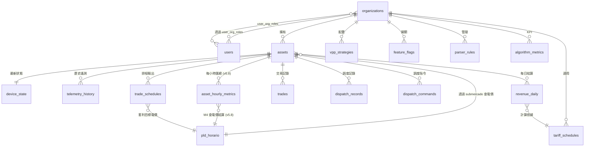

# 10. Database Schema — v5.10

> **版本**: v5.10 | **建立日期**: 2026-03-05 | **負責人**: Shared Infrastructure
>
> **變更說明**: v5.10 DB Bootstrap Fix & Dual-Role RLS Architecture — 修復 `feature_flags` 表的 UNIQUE 約束語法錯誤，
> 移除 seed 腳本中對不存在欄位的引用，**以雙角色 DB 架構取代危險的 Admin Bypass RLS 策略**，
> 啟用 `dispatch_commands` 表的 RLS + 租戶隔離，設計統一 `bootstrap.sh` 腳本，
> 新增 `idx_dispatch_commands_status_org` 複合索引（dashboard KPI 聚合效能）。
> 表格總數：19（不變）。

---

## §1 表清單與模組所有權

| 表名 | 所屬模組 | 類型 | 說明 |
|------|---------|------|------|
| organizations | M6 Identity | 主表 | 租戶/組織 |
| users | M6 Identity | 主表 | 使用者帳號 |
| user_org_roles | M6 Identity | 關聯表 | RBAC 角色 |
| assets | M1 IoT Hub | 主表 | 儲能設備（含 capacity_kwh、submercado、retail_rates）|
| device_state | M1 IoT Hub | 狀態表 | 每台設備最新遙測（持續覆寫）|
| telemetry_history | M1 IoT Hub | 時序表 | 5 分鐘歷史遙測（PARTITION BY RANGE）— **v5.8 起為 M1 內部表，不對外暴露** |
| **asset_hourly_metrics** | Shared Contract | 匯總表 | **v5.8 新增** — 每小時資產充放電匯總 (Data Contract for M4 Billing) |
| tariff_schedules | M4 Market & Billing | 參考表 | 電價時段表（R$/kWh）|
| weather_cache | M4 Market & Billing | 快取表 | 天氣數據快取（v5.7 起由 M7 Webhook 動態更新）|
| revenue_daily | M4 Market & Billing | 結算表 | 每日財務結算（雙軌：B端套利 + C端省電）|
| trades | M4 Market & Billing | 交易表 | 電力買賣記錄 |
| **pld_horario** | M4 Market & Billing | 參考表 | **v5.5 新增** — CCEE 批發市場每小時電價（v5.7 起由 M7 Webhook 動態更新）|
| **trade_schedules** | M2 Optimization | 排程表 | **v5.5 新增** — M2 最佳化排程輸出 — **v5.8 起 expected_kwh 僅供排程參考，不再用於財務結算** |
| **algorithm_metrics** | M2 Optimization | KPI 表 | **v5.5 新增** — 演算法商業健康度指標 |
| dispatch_records | M3 DR Dispatcher | 記錄表 | VPP 調度執行記錄 |
| dispatch_commands | M3 DR Dispatcher | 指令表 | VPP 調度指令（v5.6 新增）— **v5.10: 啟用 RLS** |
| vpp_strategies | M8 Admin | 配置表 | VPP 運行策略（含 self_consumption 門檻）|
| parser_rules | M8 Admin | 配置表 | 設備數據映射規則 |
| data_dictionary | M8 Admin | 配置表 | 欄位定義字典 |
| feature_flags | M8 Admin | 配置表 | 功能開關（按 org 控制）— **v5.10: 修復 UNIQUE 約束** |

---

## §2 ER 關聯圖



> **跨模組邊界不可直接 JOIN**。例如 M4 Billing 計算收益時，不得直接 JOIN M1 的 telemetry_history 表；
> 必須透過 `asset_hourly_metrics` (Shared Contract) 取得匯總數據後再計算。

---

## §3 完整 DDL（PostgreSQL）

```sql
-- ============================================================
-- M6 Identity
-- ============================================================

CREATE TABLE organizations (
  org_id        VARCHAR(50) PRIMARY KEY,
  name          VARCHAR(200) NOT NULL,
  plan_tier     VARCHAR(20)  NOT NULL DEFAULT 'standard',
  timezone      VARCHAR(50)  NOT NULL DEFAULT 'America/Sao_Paulo',
  created_at    TIMESTAMPTZ  NOT NULL DEFAULT NOW(),
  updated_at    TIMESTAMPTZ  NOT NULL DEFAULT NOW()
);

CREATE TABLE users (
  user_id         VARCHAR(50)  PRIMARY KEY,
  email           VARCHAR(255) UNIQUE NOT NULL,
  name            VARCHAR(200),
  hashed_password VARCHAR(255),
  is_active       BOOLEAN      NOT NULL DEFAULT true,
  created_at      TIMESTAMPTZ  NOT NULL DEFAULT NOW(),
  updated_at      TIMESTAMPTZ  NOT NULL DEFAULT NOW()
);

CREATE TABLE user_org_roles (
  user_id    VARCHAR(50) NOT NULL REFERENCES users(user_id) ON DELETE CASCADE,
  org_id     VARCHAR(50) NOT NULL REFERENCES organizations(org_id) ON DELETE CASCADE,
  role       VARCHAR(30) NOT NULL, -- 'SOLFACIL_ADMIN' | 'ORG_MANAGER' | 'ORG_OPERATOR' | 'ORG_VIEWER'
  created_at TIMESTAMPTZ NOT NULL DEFAULT NOW(),
  PRIMARY KEY (user_id, org_id)
);

-- ============================================================
-- M1 IoT Hub
-- ============================================================

CREATE TABLE assets (
  asset_id       VARCHAR(50)  PRIMARY KEY,
  org_id         VARCHAR(50)  NOT NULL REFERENCES organizations(org_id),
  name           VARCHAR(200) NOT NULL,
  region         VARCHAR(10),
  capacidade_kw  DECIMAL(6,2),
  capacity_kwh   DECIMAL(6,2) NOT NULL,
  operation_mode VARCHAR(50),
  submercado           VARCHAR(10) NOT NULL DEFAULT 'SUDESTE'
      CHECK (submercado IN ('SUDESTE','SUL','NORDESTE','NORTE')),
  retail_buy_rate_kwh  NUMERIC(8,4) NOT NULL DEFAULT 0.80,
  retail_sell_rate_kwh NUMERIC(8,4) NOT NULL DEFAULT 0.25,
  is_active      BOOLEAN      NOT NULL DEFAULT true,
  created_at     TIMESTAMPTZ  NOT NULL DEFAULT NOW(),
  updated_at     TIMESTAMPTZ  NOT NULL DEFAULT NOW()
);
CREATE INDEX idx_assets_org ON assets (org_id);

CREATE TABLE device_state (
  asset_id        VARCHAR(50)  PRIMARY KEY REFERENCES assets(asset_id) ON DELETE CASCADE,
  battery_soc     DECIMAL(5,2),
  bat_soh         DECIMAL(5,2),
  bat_work_status VARCHAR(20),
  battery_voltage DECIMAL(6,2),
  bat_cycle_count INTEGER,
  pv_power        DECIMAL(8,3),
  battery_power   DECIMAL(8,3),
  grid_power_kw   DECIMAL(8,3),
  load_power      DECIMAL(8,3),
  inverter_temp   DECIMAL(5,2),
  is_online       BOOLEAN      NOT NULL DEFAULT false,
  grid_frequency  DECIMAL(6,3),
  updated_at      TIMESTAMPTZ  NOT NULL DEFAULT NOW()
);

CREATE TABLE telemetry_history (
  id             BIGSERIAL,
  asset_id       VARCHAR(50)  NOT NULL,
  recorded_at    TIMESTAMPTZ  NOT NULL,
  battery_soc    DECIMAL(5,2),
  pv_power       DECIMAL(8,3),
  battery_power  DECIMAL(8,3),
  grid_power_kw  DECIMAL(8,3),
  load_power     DECIMAL(8,3),
  bat_work_status VARCHAR(20),
  grid_import_kwh DECIMAL(10,3),
  grid_export_kwh DECIMAL(10,3),
  PRIMARY KEY (id, recorded_at)
) PARTITION BY RANGE (recorded_at);

CREATE TABLE telemetry_history_2026_02
  PARTITION OF telemetry_history
  FOR VALUES FROM ('2026-02-01') TO ('2026-03-01');

CREATE TABLE telemetry_history_2026_03
  PARTITION OF telemetry_history
  FOR VALUES FROM ('2026-03-01') TO ('2026-04-01');

CREATE TABLE telemetry_history_default
  PARTITION OF telemetry_history DEFAULT;

CREATE INDEX idx_telemetry_asset_time
  ON telemetry_history (asset_id, recorded_at DESC);

-- ============================================================
-- Shared Contract Tables (v5.8)
-- ============================================================

CREATE TABLE asset_hourly_metrics (
  id              BIGSERIAL PRIMARY KEY,
  asset_id        UUID NOT NULL REFERENCES assets(id),
  hour_timestamp  TIMESTAMPTZ NOT NULL,
  total_charge_kwh    NUMERIC(10,4) NOT NULL DEFAULT 0,
  total_discharge_kwh NUMERIC(10,4) NOT NULL DEFAULT 0,
  data_points_count   INT NOT NULL DEFAULT 0,
  created_at      TIMESTAMPTZ NOT NULL DEFAULT NOW(),
  updated_at      TIMESTAMPTZ NOT NULL DEFAULT NOW(),
  CONSTRAINT uq_asset_hourly UNIQUE (asset_id, hour_timestamp)
);
CREATE INDEX idx_asset_hourly_asset_hour ON asset_hourly_metrics (asset_id, hour_timestamp DESC);
CREATE INDEX idx_asset_hourly_hour ON asset_hourly_metrics (hour_timestamp DESC);

-- ============================================================
-- M4 Market & Billing
-- ============================================================

CREATE TABLE tariff_schedules (
  id             SERIAL       PRIMARY KEY,
  org_id         VARCHAR(50)  NOT NULL REFERENCES organizations(org_id),
  schedule_name  VARCHAR(100) NOT NULL,
  peak_start     TIME         NOT NULL,
  peak_end       TIME         NOT NULL,
  peak_rate      DECIMAL(8,4) NOT NULL,
  offpeak_rate   DECIMAL(8,4) NOT NULL,
  feed_in_rate   DECIMAL(8,4) NOT NULL,
  currency       VARCHAR(3)   NOT NULL DEFAULT 'BRL',
  effective_from DATE         NOT NULL,
  effective_to   DATE,
  created_at     TIMESTAMPTZ  NOT NULL DEFAULT NOW()
);

CREATE TABLE weather_cache (
  id           SERIAL       PRIMARY KEY,
  location     VARCHAR(100) NOT NULL,
  recorded_at  TIMESTAMPTZ  NOT NULL,
  temperature  DECIMAL(5,2),
  irradiance   DECIMAL(8,2),
  cloud_cover  DECIMAL(5,2),
  source       VARCHAR(50),
  created_at   TIMESTAMPTZ  NOT NULL DEFAULT NOW(),
  UNIQUE (location, recorded_at)
);
CREATE INDEX idx_weather_location_time ON weather_cache (location, recorded_at DESC);

CREATE TABLE revenue_daily (
  id                  SERIAL       PRIMARY KEY,
  asset_id            VARCHAR(50)  NOT NULL REFERENCES assets(asset_id),
  date                DATE         NOT NULL,
  pv_energy_kwh       DECIMAL(10,3),
  grid_export_kwh     DECIMAL(10,3),
  grid_import_kwh     DECIMAL(10,3),
  bat_discharged_kwh  DECIMAL(10,3),
  revenue_reais       DECIMAL(12,2),
  cost_reais          DECIMAL(12,2),
  profit_reais        DECIMAL(12,2),
  vpp_arbitrage_profit_reais NUMERIC(12,2),
  client_savings_reais       NUMERIC(12,2),
  actual_self_consumption_pct NUMERIC(5,2),
  tariff_schedule_id  INTEGER      REFERENCES tariff_schedules(id),
  calculated_at       TIMESTAMPTZ,
  created_at          TIMESTAMPTZ  NOT NULL DEFAULT NOW(),
  UNIQUE (asset_id, date)
);
CREATE INDEX idx_revenue_asset_date ON revenue_daily (asset_id, date DESC);

CREATE TABLE trades (
  id             SERIAL       PRIMARY KEY,
  asset_id       VARCHAR(50)  NOT NULL REFERENCES assets(asset_id),
  traded_at      TIMESTAMPTZ  NOT NULL,
  trade_type     VARCHAR(20)  NOT NULL,
  energy_kwh     DECIMAL(10,3) NOT NULL,
  price_per_kwh  DECIMAL(8,4) NOT NULL,
  total_reais    DECIMAL(12,2) NOT NULL,
  created_at     TIMESTAMPTZ  NOT NULL DEFAULT NOW()
);
CREATE INDEX idx_trades_asset_time ON trades (asset_id, traded_at DESC);

CREATE TABLE pld_horario (
    mes_referencia INT NOT NULL,
    dia            SMALLINT NOT NULL,
    hora           SMALLINT NOT NULL,
    submercado     VARCHAR(10) NOT NULL,
    pld_hora       NUMERIC(10,2) NOT NULL,
    PRIMARY KEY (mes_referencia, dia, hora, submercado)
);

-- ============================================================
-- v5.5 新增：M2 排程輸出
-- ============================================================

CREATE TABLE trade_schedules (
    id                  SERIAL PRIMARY KEY,
    asset_id            VARCHAR(50) NOT NULL REFERENCES assets(asset_id),
    org_id              VARCHAR(50) NOT NULL,
    planned_time        TIMESTAMPTZ NOT NULL,
    action              VARCHAR(10) NOT NULL CHECK (action IN ('charge','discharge','idle')),
    expected_volume_kwh NUMERIC(8,2) NOT NULL,
    target_pld_price    NUMERIC(10,2),
    created_at          TIMESTAMPTZ DEFAULT NOW()
);

CREATE TABLE algorithm_metrics (
    id                   SERIAL PRIMARY KEY,
    org_id               VARCHAR(50) NOT NULL,
    date                 DATE NOT NULL,
    self_consumption_pct NUMERIC(5,2),
    UNIQUE (org_id, date)
);

-- ============================================================
-- M3 DR Dispatcher
-- ============================================================

CREATE TABLE dispatch_records (
  id                  SERIAL       PRIMARY KEY,
  asset_id            VARCHAR(50)  NOT NULL REFERENCES assets(asset_id),
  dispatched_at       TIMESTAMPTZ  NOT NULL,
  dispatch_type       VARCHAR(50),
  commanded_power_kw  DECIMAL(8,3),
  actual_power_kw     DECIMAL(8,3),
  success             BOOLEAN,
  response_latency_ms INTEGER,
  error_message       TEXT,
  created_at          TIMESTAMPTZ  NOT NULL DEFAULT NOW()
);
CREATE INDEX idx_dispatch_asset_time ON dispatch_records (asset_id, dispatched_at DESC);

-- dispatch_commands（v5.6 新增，v5.10: 啟用 RLS）
-- 設計文件中已存在於代碼，但之前未記載於 Database Schema 文件
-- v5.10 正式記載並啟用 RLS + 租戶隔離 + Admin Bypass
CREATE TABLE dispatch_commands (
  id              SERIAL       PRIMARY KEY,
  asset_id        VARCHAR(50)  NOT NULL REFERENCES assets(asset_id),
  org_id          VARCHAR(50)  NOT NULL REFERENCES organizations(org_id),
  action          VARCHAR(20)  NOT NULL,
  status          VARCHAR(20)  NOT NULL DEFAULT 'scheduled',
  dispatched_at   TIMESTAMPTZ  NOT NULL DEFAULT NOW(),
  completed_at    TIMESTAMPTZ,
  error_message   TEXT,
  created_at      TIMESTAMPTZ  NOT NULL DEFAULT NOW()
);
CREATE INDEX idx_dispatch_commands_status ON dispatch_commands (status, dispatched_at);
CREATE INDEX idx_dispatch_commands_org ON dispatch_commands (org_id);

-- v5.10: Dashboard KPI 聚合效能索引
-- 用途：GET /dashboard 每次載入時執行
--   SELECT COUNT(*) FILTER (WHERE status = 'completed') FROM dispatch_commands
--   WHERE org_id = $1 AND dispatched_at >= CURRENT_DATE
-- 50,000+ 設備場景下避免全表掃描。org_id 在前（RLS 過濾），status 居中（FILTER），
-- dispatched_at DESC 末位（時間範圍掃描）。
CREATE INDEX idx_dispatch_commands_status_org
  ON dispatch_commands (org_id, status, dispatched_at DESC);

-- ============================================================
-- M8 Admin Control Plane
-- ============================================================

CREATE TABLE vpp_strategies (
  id                   SERIAL       PRIMARY KEY,
  org_id               VARCHAR(50)  NOT NULL REFERENCES organizations(org_id),
  strategy_name        VARCHAR(100) NOT NULL,
  target_mode          VARCHAR(50)  NOT NULL,
  min_soc              DECIMAL(5,2) NOT NULL DEFAULT 20,
  max_soc              DECIMAL(5,2) NOT NULL DEFAULT 95,
  charge_window_start  TIME,
  charge_window_end    TIME,
  discharge_window_start TIME,
  max_charge_rate_kw   DECIMAL(6,2),
  target_self_consumption_pct NUMERIC(5,2) DEFAULT 80.0,
  is_default           BOOLEAN      NOT NULL DEFAULT false,
  is_active            BOOLEAN      NOT NULL DEFAULT true,
  created_at           TIMESTAMPTZ  NOT NULL DEFAULT NOW(),
  updated_at           TIMESTAMPTZ  NOT NULL DEFAULT NOW()
);

CREATE TABLE parser_rules (
  id              SERIAL       PRIMARY KEY,
  org_id          VARCHAR(50)  NOT NULL REFERENCES organizations(org_id),
  manufacturer    VARCHAR(100),
  model_version   VARCHAR(100),
  mapping_rule    JSONB        NOT NULL,
  unit_conversions JSONB,
  is_active       BOOLEAN      NOT NULL DEFAULT true,
  created_at      TIMESTAMPTZ  NOT NULL DEFAULT NOW(),
  updated_at      TIMESTAMPTZ  NOT NULL DEFAULT NOW()
);

CREATE TABLE data_dictionary (
  field_id      VARCHAR(100) PRIMARY KEY,
  domain        VARCHAR(20)  NOT NULL,
  display_name  VARCHAR(200) NOT NULL,
  value_type    VARCHAR(20)  NOT NULL,
  unit          VARCHAR(20),
  is_protected  BOOLEAN      NOT NULL DEFAULT false,
  created_at    TIMESTAMPTZ  NOT NULL DEFAULT NOW()
);

-- v5.10 FIX: 移除無效的 UNIQUE table constraint，改為 CREATE UNIQUE INDEX
CREATE TABLE feature_flags (
  id           SERIAL       PRIMARY KEY,
  flag_name    VARCHAR(100) NOT NULL,
  org_id       VARCHAR(50)  REFERENCES organizations(org_id),  -- NULL = 全局
  is_enabled   BOOLEAN      NOT NULL DEFAULT false,
  description  TEXT,
  created_at   TIMESTAMPTZ  NOT NULL DEFAULT NOW(),
  updated_at   TIMESTAMPTZ  NOT NULL DEFAULT NOW()
);

-- v5.10 FIX: COALESCE 表達式不能用於 table-level UNIQUE constraint，
-- 必須使用 CREATE UNIQUE INDEX 語法。
-- 舊版（無效 SQL）：UNIQUE (flag_name, COALESCE(org_id, ''))
-- 新版（正確 SQL）：
CREATE UNIQUE INDEX uq_feature_flags_name_org ON feature_flags (flag_name, COALESCE(org_id, ''));
```

---

## §RLS Row-Level Security — 雙角色架構 (v5.10)

> **v5.10 重大變更：以雙角色架構取代危險的 Admin Bypass**
>
> **問題（v5.9 Admin Bypass 設計的安全缺陷）**：
> 舊設計使用 `current_setting('app.current_org_id', true) IS NULL OR = ''` 作為 admin bypass 條件。
> 這意味著任何忘記設定 `app.current_org_id` 的連線**靜默獲得 god-mode 存取權限**，
> 能讀取所有租戶的數據。這不是安全的 fail-open 設計。
>
> **解決方案：雙 PostgreSQL 角色**
>
> | 角色 | 用途 | RLS 行為 |
> |------|------|---------|
> | `solfacil_app` | BFF Lambda handlers（使用者請求） | **強制 RLS**：必須設定 `app.current_org_id`，否則查詢返回空結果（安全 fail-closed） |
> | `solfacil_service` | Cron Jobs（M2/M3/M4 排程任務） | **`BYPASSRLS` 屬性**：合法繞過 RLS，讀取全量跨租戶數據 |
>
> **安全保證**：
> - `solfacil_app` 忘記設定 `org_id` → 查詢返回 **0 行**（fail-closed），不會洩漏數據
> - `solfacil_service` 是唯一能讀取全量數據的角色，且僅用於受信任的服務端 cron jobs
> - 不再有 "NULL or empty = 繞過" 的隱式條件

### §RLS.1 角色建立

```sql
-- =====================================================================
-- §RLS.1  DB Roles — 雙角色架構 (v5.10)
-- =====================================================================

-- 角色 1: BFF 應用角色（強制 RLS）
-- 所有來自使用者請求的 Lambda handler 使用此角色。
-- RLS 策略要求 app.current_org_id 必須已設定，否則返回空結果。
CREATE ROLE solfacil_app LOGIN PASSWORD :'APP_DB_PASSWORD';
GRANT CONNECT ON DATABASE solfacil_vpp TO solfacil_app;
GRANT USAGE ON SCHEMA public TO solfacil_app;
GRANT SELECT, INSERT, UPDATE, DELETE ON ALL TABLES IN SCHEMA public TO solfacil_app;
GRANT USAGE, SELECT ON ALL SEQUENCES IN SCHEMA public TO solfacil_app;

-- 角色 2: 服務角色（繞過 RLS）
-- Cron Jobs（M2 Schedule Generator、M3 Command Dispatcher、M4 Daily Billing）使用此角色。
-- BYPASSRLS 是 PostgreSQL 內建屬性，明確、可審計、不依賴 session variable 魔法。
CREATE ROLE solfacil_service LOGIN PASSWORD :'SERVICE_DB_PASSWORD' BYPASSRLS;
GRANT CONNECT ON DATABASE solfacil_vpp TO solfacil_service;
GRANT USAGE ON SCHEMA public TO solfacil_service;
GRANT SELECT, INSERT, UPDATE, DELETE ON ALL TABLES IN SCHEMA public TO solfacil_service;
GRANT USAGE, SELECT ON ALL SEQUENCES IN SCHEMA public TO solfacil_service;
```

### §RLS.2 連線池設計

```typescript
// src/shared/db/pool.ts — v5.10 雙連線池

// Pool 1: BFF handlers 使用 — 強制 RLS
export const appPool = new Pool({
  connectionString: process.env.APP_DATABASE_URL,  // user=solfacil_app
  max: 20,
  idleTimeoutMillis: 30_000,
  connectionTimeoutMillis: 5_000,
});

// Pool 2: Cron Jobs 使用 — BYPASSRLS
export const servicePool = new Pool({
  connectionString: process.env.SERVICE_DATABASE_URL,  // user=solfacil_service
  max: 10,
  idleTimeoutMillis: 30_000,
  connectionTimeoutMillis: 5_000,
});

// 向下相容：原有 `pool` export 指向 appPool
export const pool = appPool;
```

### §RLS.3 RLS 策略（純租戶隔離，無 Admin Bypass）

```sql
-- =====================================================================
-- §RLS.3  Row-Level Security — 純租戶隔離 (v5.10)
-- =====================================================================
-- 所有 RLS 策略僅檢查 org_id = current_setting('app.current_org_id')。
-- 不再有 "IS NULL OR = ''" 的 admin bypass 條件。
-- Cron jobs 使用 solfacil_service 角色（BYPASSRLS），不受 RLS 影響。

-- assets
ALTER TABLE assets ENABLE ROW LEVEL SECURITY;
CREATE POLICY rls_assets_tenant ON assets
  USING (org_id = current_setting('app.current_org_id', true));

-- trades
ALTER TABLE trades ENABLE ROW LEVEL SECURITY;
CREATE POLICY rls_trades_tenant ON trades
  USING (org_id = current_setting('app.current_org_id', true));

-- revenue_daily
ALTER TABLE revenue_daily ENABLE ROW LEVEL SECURITY;
CREATE POLICY rls_revenue_daily_tenant ON revenue_daily
  USING (org_id = current_setting('app.current_org_id', true));

-- dispatch_records
ALTER TABLE dispatch_records ENABLE ROW LEVEL SECURITY;
CREATE POLICY rls_dispatch_records_tenant ON dispatch_records
  USING (org_id = current_setting('app.current_org_id', true));

-- dispatch_commands (v5.10 新增 RLS)
ALTER TABLE dispatch_commands ENABLE ROW LEVEL SECURITY;
CREATE POLICY rls_dispatch_commands_tenant ON dispatch_commands
  USING (org_id = current_setting('app.current_org_id', true));

-- tariff_schedules
ALTER TABLE tariff_schedules ENABLE ROW LEVEL SECURITY;
CREATE POLICY rls_tariff_schedules_tenant ON tariff_schedules
  USING (org_id = current_setting('app.current_org_id', true));

-- vpp_strategies
ALTER TABLE vpp_strategies ENABLE ROW LEVEL SECURITY;
CREATE POLICY rls_vpp_strategies_tenant ON vpp_strategies
  USING (org_id = current_setting('app.current_org_id', true));

-- parser_rules（NULL org_id = 全局規則，所有人可見）
ALTER TABLE parser_rules ENABLE ROW LEVEL SECURITY;
CREATE POLICY rls_parser_rules_tenant ON parser_rules
  USING (org_id IS NULL OR org_id = current_setting('app.current_org_id', true));

-- feature_flags（NULL org_id = 全局 flag，所有人可見）
ALTER TABLE feature_flags ENABLE ROW LEVEL SECURITY;
CREATE POLICY rls_feature_flags_tenant ON feature_flags
  USING (org_id IS NULL OR org_id = current_setting('app.current_org_id', true));

-- trade_schedules（v5.5 新增）
ALTER TABLE trade_schedules ENABLE ROW LEVEL SECURITY;
CREATE POLICY rls_trade_schedules_tenant ON trade_schedules
  USING (org_id::TEXT = current_setting('app.current_org_id', true));

-- algorithm_metrics（v5.5 新增）
ALTER TABLE algorithm_metrics ENABLE ROW LEVEL SECURITY;
CREATE POLICY rls_algorithm_metrics_tenant ON algorithm_metrics
  USING (org_id::TEXT = current_setting('app.current_org_id', true));
```

---

## §4 Migration 管理原則

本系統採用**版本化前進式 Migration** 管理資料庫變更：

- **檔案命名**：`db/migrations/001_init.sql`、`002_add_weather_cache.sql`... 依序遞增，
  每次部署時按編號順序執行尚未套用的 Migration。
- **只做 Forward，不寫 Rollback**：Migration 檔案只包含 `CREATE` / `ALTER` / `INSERT` 等正向操作。
  若發現問題，建立新的 Migration 修正（例如 `003_fix_column_type.sql`），不在原 Migration 中加 `DROP` 回滾。
  這確保了生產環境的數據安全，避免意外資料遺失。
- **telemetry_history 分區維護**：由定時 Job（cron / EventBridge Schedule）在每月最後一週自動建立
  下個月的分區表（例如 `telemetry_history_2026_04`），確保新月份到來時分區已就緒。
  若分區不存在，寫入將失敗，因此此 Job 為**關鍵基礎設施**，需配置告警監控。

---

## §5 v5.10 增量 Migration

```sql
-- ============================================================
-- v5.10 Migration: 修復 feature_flags UNIQUE 約束
-- ============================================================

-- 步驟 1: 移除無效的 table-level UNIQUE constraint（如果存在）
ALTER TABLE feature_flags DROP CONSTRAINT IF EXISTS feature_flags_flag_name_coalesce_key;

-- 步驟 2: 建立正確的 UNIQUE INDEX
CREATE UNIQUE INDEX IF NOT EXISTS uq_feature_flags_name_org
  ON feature_flags (flag_name, COALESCE(org_id, ''));

-- ============================================================
-- v5.10 Migration: dispatch_commands 啟用 RLS（純租戶隔離）
-- ============================================================

ALTER TABLE dispatch_commands ENABLE ROW LEVEL SECURITY;

CREATE POLICY rls_dispatch_commands_tenant ON dispatch_commands
  USING (org_id = current_setting('app.current_org_id', true));

-- ============================================================
-- v5.10 Migration: dispatch_commands dashboard KPI 效能索引
-- ============================================================
-- 用途：GET /dashboard 每次載入時聚合 dispatch success rate
-- 查詢模式：SELECT COUNT(*) FILTER (WHERE status = 'completed')
--           FROM dispatch_commands WHERE org_id = $1 AND dispatched_at >= CURRENT_DATE
-- 50,000+ 設備場景下，此索引將全表掃描優化為索引範圍掃描。

CREATE INDEX IF NOT EXISTS idx_dispatch_commands_status_org
  ON dispatch_commands (org_id, status, dispatched_at DESC);

-- ============================================================
-- v5.10 Migration: 移除所有 Admin Bypass RLS 策略（如存在）
-- ============================================================
-- v5.10 以雙角色架構（solfacil_app + solfacil_service BYPASSRLS）取代
-- 危險的 "IS NULL OR = ''" admin bypass 條件。
-- 若從舊版升級，需清除殘留的 admin bypass policies。

DROP POLICY IF EXISTS rls_assets_admin_bypass ON assets;
DROP POLICY IF EXISTS rls_trades_admin_bypass ON trades;
DROP POLICY IF EXISTS rls_revenue_daily_admin_bypass ON revenue_daily;
DROP POLICY IF EXISTS rls_dispatch_records_admin_bypass ON dispatch_records;
DROP POLICY IF EXISTS rls_dispatch_commands_admin_bypass ON dispatch_commands;
DROP POLICY IF EXISTS rls_tariff_schedules_admin_bypass ON tariff_schedules;
DROP POLICY IF EXISTS rls_vpp_strategies_admin_bypass ON vpp_strategies;
DROP POLICY IF EXISTS rls_parser_rules_admin_bypass ON parser_rules;
DROP POLICY IF EXISTS rls_feature_flags_admin_bypass ON feature_flags;
DROP POLICY IF EXISTS rls_trade_schedules_admin_bypass ON trade_schedules;
DROP POLICY IF EXISTS rls_algorithm_metrics_admin_bypass ON algorithm_metrics;

-- ============================================================
-- v5.10 Migration: 建立 solfacil_service 角色（BYPASSRLS）
-- ============================================================
-- Cron Jobs（M2/M3/M4）使用此角色連線，合法繞過 RLS。

DO $$
BEGIN
  IF NOT EXISTS (SELECT 1 FROM pg_roles WHERE rolname = 'solfacil_service') THEN
    CREATE ROLE solfacil_service LOGIN PASSWORD 'CHANGE_ME_IN_PRODUCTION' BYPASSRLS;
  END IF;
END
$$;

GRANT CONNECT ON DATABASE solfacil_vpp TO solfacil_service;
GRANT USAGE ON SCHEMA public TO solfacil_service;
GRANT SELECT, INSERT, UPDATE, DELETE ON ALL TABLES IN SCHEMA public TO solfacil_service;
GRANT USAGE, SELECT ON ALL SEQUENCES IN SCHEMA public TO solfacil_service;
```

---

## §6 Seed 腳本修正 (v5.10)

### 移除對不存在欄位的引用

v5.9 seed 腳本中引用了 `organizations.metadata` 和 `assets.metadata` 欄位。
這兩個欄位在 v5.4 schema 重構（PostgreSQL 全面取代 DynamoDB）後不存在於 DDL 中。

**修正內容：**

| 引用位置 | 不存在欄位 | 修正方式 |
|---------|-----------|---------|
| `seed-db.sql` INSERT INTO organizations | `metadata` | 移除該欄位及其值 |
| `seed-db.sql` INSERT INTO assets | `metadata` | 移除該欄位及其值 |

> **注意**：M4 設計文件（`04_MARKET_BILLING_MODULE_v5.8.md`）中的 `assets` 表定義包含
> `metadata JSONB` 欄位（v4.0 Extensible Metadata Design），但主 Database Schema（本文件）
> 自 v5.4 起的 `assets` 表不包含此欄位。兩份文件的 DDL 定義存在差異，以本文件（Database Schema）
> 為準。seed 腳本必須對齊本文件的 DDL。

---

## §7 統一 Bootstrap 腳本設計 (v5.10)

### 問題陳述

v5.9 無法一鍵從零重建 DB。需要手動按順序執行：DDL → migration_v5.5 → migration_v5.6 →
migration_v5.8 → migration_v5.10 → seed_v5.4 → seed_v5.5。順序錯誤會導致 FK 約束失敗或數據缺失。

### 解決方案：`scripts/bootstrap.sh`

設計一個統一入口腳本，一鍵完成 DB 從零到可用：

```bash
#!/usr/bin/env bash
# scripts/bootstrap.sh — One-command DB rebuild
# Usage: ./scripts/bootstrap.sh [--drop-existing]
set -euo pipefail

DB_NAME="${DB_NAME:-solfacil_vpp}"
DB_ADMIN_USER="${DB_ADMIN_USER:-postgres}"  # superuser for role creation
DB_USER="${DB_USER:-solfacil_app}"
DB_HOST="${DB_HOST:-localhost}"
DB_PORT="${DB_PORT:-5432}"
APP_DB_PASSWORD="${APP_DB_PASSWORD:-app_password}"
SERVICE_DB_PASSWORD="${SERVICE_DB_PASSWORD:-service_password}"

PSQL_ADMIN="psql -h $DB_HOST -p $DB_PORT -U $DB_ADMIN_USER"
PSQL="psql -h $DB_HOST -p $DB_PORT -U $DB_USER"

echo "=== SOLFACIL VPP Database Bootstrap (v5.10 — Dual-Role Architecture) ==="

# Step 0: Optional drop + create
if [[ "${1:-}" == "--drop-existing" ]]; then
  echo "[0/7] Dropping existing database..."
  $PSQL_ADMIN -c "DROP DATABASE IF EXISTS $DB_NAME;"
  $PSQL_ADMIN -c "CREATE DATABASE $DB_NAME;"
fi

# Step 1: Create dual DB roles (requires superuser)
echo "[1/7] Creating DB roles (solfacil_app + solfacil_service)..."
$PSQL_ADMIN -d $DB_NAME -v APP_DB_PASSWORD="$APP_DB_PASSWORD" -v SERVICE_DB_PASSWORD="$SERVICE_DB_PASSWORD" <<'ROLES_SQL'
DO $$
BEGIN
  IF NOT EXISTS (SELECT 1 FROM pg_roles WHERE rolname = 'solfacil_app') THEN
    CREATE ROLE solfacil_app LOGIN PASSWORD :'APP_DB_PASSWORD';
  END IF;
  IF NOT EXISTS (SELECT 1 FROM pg_roles WHERE rolname = 'solfacil_service') THEN
    CREATE ROLE solfacil_service LOGIN PASSWORD :'SERVICE_DB_PASSWORD' BYPASSRLS;
  END IF;
END
$$;
GRANT CONNECT ON DATABASE solfacil_vpp TO solfacil_app, solfacil_service;
GRANT USAGE ON SCHEMA public TO solfacil_app, solfacil_service;
ROLES_SQL

# Step 2: Base DDL (v5.4 schema — 15 core tables)
echo "[2/7] Applying base DDL..."
$PSQL_ADMIN -d $DB_NAME -f db/migrations/001_init.sql

# Step 3: v5.5 migrations (3 new tables + ALTER TABLE extensions)
echo "[3/7] Applying v5.5 migrations..."
$PSQL_ADMIN -d $DB_NAME -f db/migrations/002_v5.5_dual_tier.sql

# Step 4: v5.6 migrations (dispatch_commands table)
echo "[4/7] Applying v5.6 migrations..."
$PSQL_ADMIN -d $DB_NAME -f db/migrations/003_v5.6_dispatch_commands.sql

# Step 5: v5.8 migrations (asset_hourly_metrics)
echo "[5/7] Applying v5.8 migrations..."
$PSQL_ADMIN -d $DB_NAME -f db/migrations/004_v5.8_hourly_metrics.sql

# Step 6: v5.10 migrations (feature_flags fix + dual-role RLS + performance index)
echo "[6/7] Applying v5.10 migrations..."
$PSQL_ADMIN -d $DB_NAME -f db/migrations/005_v5.10_dual_role_rls.sql

# Grant table permissions after all tables exist
$PSQL_ADMIN -d $DB_NAME -c "GRANT SELECT, INSERT, UPDATE, DELETE ON ALL TABLES IN SCHEMA public TO solfacil_app, solfacil_service;"
$PSQL_ADMIN -d $DB_NAME -c "GRANT USAGE, SELECT ON ALL SEQUENCES IN SCHEMA public TO solfacil_app, solfacil_service;"

# Step 7: Seed data
echo "[7/7] Seeding data..."
$PSQL_ADMIN -d $DB_NAME -f db/seed/seed-db.sql

echo "=== Bootstrap complete. Database '$DB_NAME' is ready. ==="
echo "  - solfacil_app:     BFF handlers (RLS enforced)"
echo "  - solfacil_service: Cron jobs (BYPASSRLS)"
```

### 設計約束

1. **冪等性**：每個 migration 使用 `IF NOT EXISTS` / `IF EXISTS` 保護，重複執行不報錯
2. **順序固定**：migration 編號強制執行順序，不可跳步
3. **環境變數**：DB 連線資訊透過環境變數注入，支持 local / CI / staging
4. **seed 數據對齊 DDL**：seed 腳本不得引用 DDL 中不存在的欄位

---

## §66 跨模組邊界規則（v5.8 強化）

> **v5.8 強化：透過 asset_hourly_metrics (Shared Contract) 實現 M1→M4 數據傳遞，零直接跨模組 JOIN。**

| 規則 | 說明 |
|------|------|
| 嚴禁跨模組直接 SQL JOIN | 例如 M4 不得直接 JOIN M1 的 `telemetry_history` |
| M1 對外數據契約 | `asset_hourly_metrics` — 由 M1 Aggregator Job 每小時寫入 |
| M4 數據來源 | 財務結算**僅**讀取 `asset_hourly_metrics`，嚴禁直接讀取 `telemetry_history` |
| 違規定義 | 任何模組直接讀取其他模組的內部表 = **架構邊界違規 (Architecture Boundary Breach)** |
| `telemetry_history` 存取限制 | 自 v5.8 起為 M1 內部表，不對外暴露。外部模組應讀取 `asset_hourly_metrics` |
| `trade_schedules.expected_kwh` | 自 v5.8 起僅供排程參考，不再用於最終財務結算。真實度數來源：`asset_hourly_metrics` |

---

## Document History

| Version | Date | Summary |
|---------|------|---------|
| v5.4 | 2026-02-27 | PostgreSQL 全面取代 DynamoDB/Timestream，15 張表確認 |
| v5.5 | 2026-02-28 | 雙層經濟模型：+3 表 (pld_horario/trade_schedules/algorithm_metrics)，擴充 assets/revenue_daily/vpp_strategies，18 張表 |
| v5.7 | 2026-02-28 | External Ingestion：pld_horario 改為由 M7 Inbound Webhook 動態更新；weather_cache 啟用 M7 Webhook 寫入；dispatch_commands 表（v5.6 已建）補記文件 |
| v5.8 | 2026-03-02 | Closed-loop Billing via Data Contract: asset_hourly_metrics 新增，M1 Aggregator Job，M4 切換真實度數結算，19 張表 |
| **v5.10** | **2026-03-05** | **DB Bootstrap Fix & Dual-Role RLS Architecture: (1) feature_flags UNIQUE 約束語法修復, (2) seed 腳本移除不存在欄位引用, (3) 以雙角色架構 (solfacil_app + solfacil_service BYPASSRLS) 取代危險的 Admin Bypass RLS 策略, (4) dispatch_commands 啟用 RLS 純租戶隔離, (5) 新增 idx_dispatch_commands_status_org 複合索引 (dashboard KPI 效能), (6) 雙連線池設計 (appPool + servicePool), (7) 統一 bootstrap.sh 含雙角色建立** |
