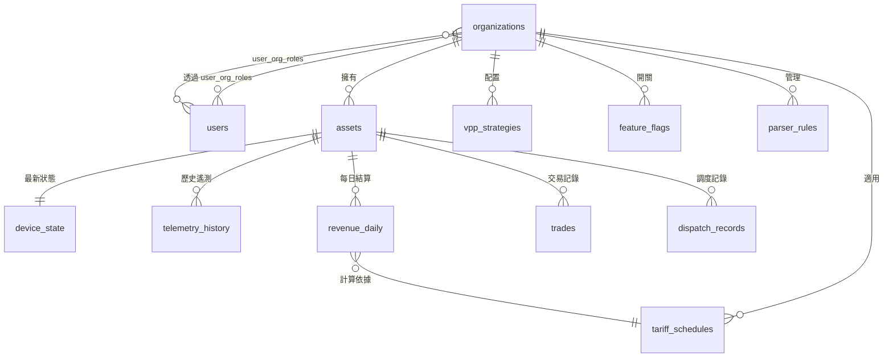

# 10. Database Schema — v5.4
> **版本**: v5.4 | **建立日期**: 2026-02-27 | **負責人**: Shared Infrastructure
>
> **變更說明**: v5.4 全面遷移至 PostgreSQL，取代 DynamoDB（設備 Shadow、Admin 配置）
> 與 Timestream（時序遙測）。所有模組共用單一 PostgreSQL 實例，各模組各自擁有自己的表。
> 跨模組數據存取**嚴禁直接 JOIN**，必須透過 API/Service 層呼叫。

---

## §1 表清單與模組所有權

| 表名 | 所屬模組 | 類型 | 說明 |
|------|---------|------|------|
| organizations | M6 Identity | 主表 | 租戶/組織 |
| users | M6 Identity | 主表 | 使用者帳號 |
| user_org_roles | M6 Identity | 關聯表 | RBAC 角色 |
| assets | M1 IoT Hub | 主表 | 儲能設備（取代 unidades，含 capacity_kwh）|
| device_state | M1 IoT Hub | 狀態表 | 每台設備最新遙測（持續覆寫）|
| telemetry_history | M1 IoT Hub | 時序表 | 5 分鐘歷史遙測（PARTITION BY RANGE）|
| tariff_schedules | M4 Market & Billing | 參考表 | 電價時段表（R$/kWh）|
| weather_cache | M4 Market & Billing | 快取表 | 天氣數據快取（每小時更新）|
| revenue_daily | M4 Market & Billing | 結算表 | 每日財務結算（凌晨批次計算）|
| trades | M4 Market & Billing | 交易表 | 電力買賣記錄 |
| dispatch_records | M3 DR Dispatcher | 記錄表 | VPP 調度執行記錄 |
| vpp_strategies | M8 Admin | 配置表 | VPP 運行策略 |
| parser_rules | M8 Admin | 配置表 | 設備數據映射規則 |
| data_dictionary | M8 Admin | 配置表 | 欄位定義字典 |
| feature_flags | M8 Admin | 配置表 | 功能開關（按 org 控制）|

---

## §2 ER 關聯圖



> ⚠️ **跨模組邊界不可直接 JOIN**。例如 M4 Billing 計算收益時，不得直接 JOIN M1 的 telemetry_history 表；
> 必須透過 M1 提供的 Service 方法取得數據後再計算。

---

## §3 完整 DDL（PostgreSQL）

```sql
-- ============================================================
-- M6 Identity
-- ============================================================

CREATE TABLE organizations (
  org_id        VARCHAR(50) PRIMARY KEY,
  name          VARCHAR(200) NOT NULL,
  plan_tier     VARCHAR(20)  NOT NULL DEFAULT 'standard',
  timezone      VARCHAR(50)  NOT NULL DEFAULT 'America/Sao_Paulo',
  created_at    TIMESTAMPTZ  NOT NULL DEFAULT NOW(),
  updated_at    TIMESTAMPTZ  NOT NULL DEFAULT NOW()
);

CREATE TABLE users (
  user_id         VARCHAR(50)  PRIMARY KEY,
  email           VARCHAR(255) UNIQUE NOT NULL,
  name            VARCHAR(200),
  hashed_password VARCHAR(255),
  is_active       BOOLEAN      NOT NULL DEFAULT true,
  created_at      TIMESTAMPTZ  NOT NULL DEFAULT NOW(),
  updated_at      TIMESTAMPTZ  NOT NULL DEFAULT NOW()
);

CREATE TABLE user_org_roles (
  user_id    VARCHAR(50) NOT NULL REFERENCES users(user_id) ON DELETE CASCADE,
  org_id     VARCHAR(50) NOT NULL REFERENCES organizations(org_id) ON DELETE CASCADE,
  role       VARCHAR(30) NOT NULL, -- 'SOLFACIL_ADMIN' | 'ORG_MANAGER' | 'ORG_OPERATOR' | 'ORG_VIEWER'
  created_at TIMESTAMPTZ NOT NULL DEFAULT NOW(),
  PRIMARY KEY (user_id, org_id)
);

-- ============================================================
-- M1 IoT Hub
-- ============================================================

-- ⚠️ v5.4 HEMS 單戶場景：capacity_kwh 取代舊版 unidades（聚合器欄位已移除）
CREATE TABLE assets (
  asset_id       VARCHAR(50)  PRIMARY KEY,
  org_id         VARCHAR(50)  NOT NULL REFERENCES organizations(org_id),
  name           VARCHAR(200) NOT NULL,
  region         VARCHAR(10),
  capacidade_kw  DECIMAL(6,2),                      -- 逆變器額定功率 (kW)
  capacity_kwh   DECIMAL(6,2) NOT NULL,              -- 電池系統裝機容量 (kWh)，v5.3 新增
  operation_mode VARCHAR(50),                        -- 'peak_valley_arbitrage' | 'self_consumption' | 'peak_shaving'
  is_active      BOOLEAN      NOT NULL DEFAULT true,
  created_at     TIMESTAMPTZ  NOT NULL DEFAULT NOW(),
  updated_at     TIMESTAMPTZ  NOT NULL DEFAULT NOW()
);
CREATE INDEX idx_assets_org ON assets (org_id);

-- 最新遙測狀態（每台設備只有一行，每次上報 UPSERT 覆寫）
CREATE TABLE device_state (
  asset_id        VARCHAR(50)  PRIMARY KEY REFERENCES assets(asset_id) ON DELETE CASCADE,
  battery_soc     DECIMAL(5,2),                      -- %
  bat_soh         DECIMAL(5,2),                      -- %
  bat_work_status VARCHAR(20),                       -- 'charging' | 'discharging' | 'idle'
  battery_voltage DECIMAL(6,2),                      -- V
  bat_cycle_count INTEGER,
  pv_power        DECIMAL(8,3),                      -- kW
  battery_power   DECIMAL(8,3),                      -- kW，正=充電，負=放電
  grid_power_kw   DECIMAL(8,3),                      -- kW，正=買電，負=賣電
  load_power      DECIMAL(8,3),                      -- kW
  inverter_temp   DECIMAL(5,2),                      -- °C
  is_online       BOOLEAN      NOT NULL DEFAULT false,
  grid_frequency  DECIMAL(6,3),                      -- Hz
  updated_at      TIMESTAMPTZ  NOT NULL DEFAULT NOW()
);

-- 5 分鐘歷史遙測（Partition by Range 按月分表）
CREATE TABLE telemetry_history (
  id             BIGSERIAL,
  asset_id       VARCHAR(50)  NOT NULL,
  recorded_at    TIMESTAMPTZ  NOT NULL,
  battery_soc    DECIMAL(5,2),
  pv_power       DECIMAL(8,3),
  battery_power  DECIMAL(8,3),
  grid_power_kw  DECIMAL(8,3),
  load_power     DECIMAL(8,3),
  bat_work_status VARCHAR(20),
  grid_import_kwh DECIMAL(10,3),
  grid_export_kwh DECIMAL(10,3),
  PRIMARY KEY (id, recorded_at)
) PARTITION BY RANGE (recorded_at);

-- 初始分區（每月一個，由 Migration Job 自動建立後續月份）
CREATE TABLE telemetry_history_2026_02
  PARTITION OF telemetry_history
  FOR VALUES FROM ('2026-02-01') TO ('2026-03-01');

CREATE TABLE telemetry_history_2026_03
  PARTITION OF telemetry_history
  FOR VALUES FROM ('2026-03-01') TO ('2026-04-01');

CREATE INDEX idx_telemetry_asset_time
  ON telemetry_history (asset_id, recorded_at DESC);

-- ============================================================
-- M4 Market & Billing
-- ============================================================

CREATE TABLE tariff_schedules (
  id             SERIAL       PRIMARY KEY,
  org_id         VARCHAR(50)  NOT NULL REFERENCES organizations(org_id),
  schedule_name  VARCHAR(100) NOT NULL,
  peak_start     TIME         NOT NULL,
  peak_end       TIME         NOT NULL,
  peak_rate      DECIMAL(8,4) NOT NULL,              -- R$/kWh 峰時電價
  offpeak_rate   DECIMAL(8,4) NOT NULL,              -- R$/kWh 谷時電價
  feed_in_rate   DECIMAL(8,4) NOT NULL,              -- R$/kWh 上網電價
  currency       VARCHAR(3)   NOT NULL DEFAULT 'BRL',
  effective_from DATE         NOT NULL,
  effective_to   DATE,                               -- NULL = 仍有效
  created_at     TIMESTAMPTZ  NOT NULL DEFAULT NOW()
);

CREATE TABLE weather_cache (
  id           SERIAL       PRIMARY KEY,
  location     VARCHAR(100) NOT NULL,
  recorded_at  TIMESTAMPTZ  NOT NULL,
  temperature  DECIMAL(5,2),                         -- °C
  irradiance   DECIMAL(8,2),                         -- W/m²
  cloud_cover  DECIMAL(5,2),                         -- %
  source       VARCHAR(50),
  created_at   TIMESTAMPTZ  NOT NULL DEFAULT NOW(),
  UNIQUE (location, recorded_at)
);
CREATE INDEX idx_weather_location_time ON weather_cache (location, recorded_at DESC);

-- 每日財務結算（凌晨批次計算後寫入）
CREATE TABLE revenue_daily (
  id                  SERIAL       PRIMARY KEY,
  asset_id            VARCHAR(50)  NOT NULL REFERENCES assets(asset_id),
  date                DATE         NOT NULL,
  pv_energy_kwh       DECIMAL(10,3),
  grid_export_kwh     DECIMAL(10,3),
  grid_import_kwh     DECIMAL(10,3),
  bat_discharged_kwh  DECIMAL(10,3),
  revenue_reais       DECIMAL(12,2),
  cost_reais          DECIMAL(12,2),
  profit_reais        DECIMAL(12,2),
  tariff_schedule_id  INTEGER      REFERENCES tariff_schedules(id),
  calculated_at       TIMESTAMPTZ,
  created_at          TIMESTAMPTZ  NOT NULL DEFAULT NOW(),
  UNIQUE (asset_id, date)
);
CREATE INDEX idx_revenue_asset_date ON revenue_daily (asset_id, date DESC);

CREATE TABLE trades (
  id             SERIAL       PRIMARY KEY,
  asset_id       VARCHAR(50)  NOT NULL REFERENCES assets(asset_id),
  traded_at      TIMESTAMPTZ  NOT NULL,
  trade_type     VARCHAR(20)  NOT NULL,              -- 'export' | 'import' | 'arbitrage'
  energy_kwh     DECIMAL(10,3) NOT NULL,
  price_per_kwh  DECIMAL(8,4) NOT NULL,
  total_reais    DECIMAL(12,2) NOT NULL,
  created_at     TIMESTAMPTZ  NOT NULL DEFAULT NOW()
);
CREATE INDEX idx_trades_asset_time ON trades (asset_id, traded_at DESC);

-- ============================================================
-- M3 DR Dispatcher
-- ============================================================

CREATE TABLE dispatch_records (
  id                  SERIAL       PRIMARY KEY,
  asset_id            VARCHAR(50)  NOT NULL REFERENCES assets(asset_id),
  dispatched_at       TIMESTAMPTZ  NOT NULL,
  dispatch_type       VARCHAR(50),                   -- 'peak_shaving' | 'dr_event' | 'vpp_command'
  commanded_power_kw  DECIMAL(8,3),
  actual_power_kw     DECIMAL(8,3),
  success             BOOLEAN,
  response_latency_ms INTEGER,
  error_message       TEXT,
  created_at          TIMESTAMPTZ  NOT NULL DEFAULT NOW()
);
CREATE INDEX idx_dispatch_asset_time ON dispatch_records (asset_id, dispatched_at DESC);

-- ============================================================
-- M8 Admin Control Plane
-- ============================================================

CREATE TABLE vpp_strategies (
  id                   SERIAL       PRIMARY KEY,
  org_id               VARCHAR(50)  NOT NULL REFERENCES organizations(org_id),
  strategy_name        VARCHAR(100) NOT NULL,
  target_mode          VARCHAR(50)  NOT NULL,        -- 'peak_valley_arbitrage' | 'self_consumption' | 'peak_shaving'
  min_soc              DECIMAL(5,2) NOT NULL DEFAULT 20,
  max_soc              DECIMAL(5,2) NOT NULL DEFAULT 95,
  charge_window_start  TIME,
  charge_window_end    TIME,
  discharge_window_start TIME,
  max_charge_rate_kw   DECIMAL(6,2),
  is_default           BOOLEAN      NOT NULL DEFAULT false,
  is_active            BOOLEAN      NOT NULL DEFAULT true,
  created_at           TIMESTAMPTZ  NOT NULL DEFAULT NOW(),
  updated_at           TIMESTAMPTZ  NOT NULL DEFAULT NOW()
);

CREATE TABLE parser_rules (
  id              SERIAL       PRIMARY KEY,
  org_id          VARCHAR(50)  NOT NULL REFERENCES organizations(org_id),
  manufacturer    VARCHAR(100),
  model_version   VARCHAR(100),
  mapping_rule    JSONB        NOT NULL,
  unit_conversions JSONB,
  is_active       BOOLEAN      NOT NULL DEFAULT true,
  created_at      TIMESTAMPTZ  NOT NULL DEFAULT NOW(),
  updated_at      TIMESTAMPTZ  NOT NULL DEFAULT NOW()
);

CREATE TABLE data_dictionary (
  field_id      VARCHAR(100) PRIMARY KEY,            -- e.g. 'metering.grid_power_kw'
  domain        VARCHAR(20)  NOT NULL,               -- 'metering' | 'status' | 'config'
  display_name  VARCHAR(200) NOT NULL,
  value_type    VARCHAR(20)  NOT NULL,               -- 'number' | 'string' | 'boolean'
  unit          VARCHAR(20),
  is_protected  BOOLEAN      NOT NULL DEFAULT false,
  created_at    TIMESTAMPTZ  NOT NULL DEFAULT NOW()
);

CREATE TABLE feature_flags (
  id           SERIAL       PRIMARY KEY,
  flag_name    VARCHAR(100) NOT NULL,
  org_id       VARCHAR(50)  REFERENCES organizations(org_id),  -- NULL = 全局
  is_enabled   BOOLEAN      NOT NULL DEFAULT false,
  description  TEXT,
  created_at   TIMESTAMPTZ  NOT NULL DEFAULT NOW(),
  updated_at   TIMESTAMPTZ  NOT NULL DEFAULT NOW(),
  UNIQUE (flag_name, COALESCE(org_id, ''))
);
```

---

## §4 Migration 管理原則

本系統採用**版本化前進式 Migration** 管理資料庫變更：

- **檔案命名**：`db/migrations/001_init.sql`、`002_add_weather_cache.sql`... 依序遞增，
  每次部署時按編號順序執行尚未套用的 Migration。
- **只做 Forward，不寫 Rollback**：Migration 檔案只包含 `CREATE` / `ALTER` / `INSERT` 等正向操作。
  若發現問題，建立新的 Migration 修正（例如 `003_fix_column_type.sql`），不在原 Migration 中加 `DROP` 回滾。
  這確保了生產環境的數據安全，避免意外資料遺失。
- **telemetry_history 分區維護**：由定時 Job（cron / EventBridge Schedule）在每月最後一週自動建立
  下個月的分區表（例如 `telemetry_history_2026_04`），確保新月份到來時分區已就緒。
  若分區不存在，寫入將失敗，因此此 Job 為**關鍵基礎設施**，需配置告警監控。
