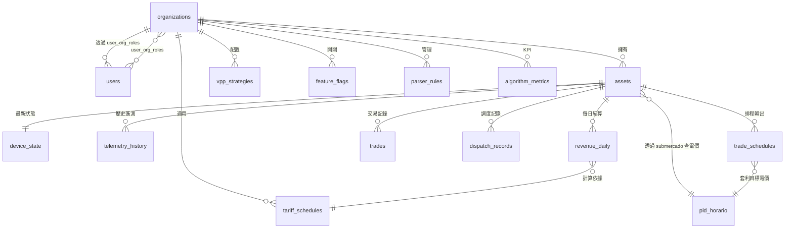

# 10. Database Schema — v5.5
> **版本**: v5.5 | **建立日期**: 2026-02-28 | **負責人**: Shared Infrastructure
>
> **變更說明**: v5.5 雙層經濟模型 — 新增 3 張表（pld_horario / trade_schedules / algorithm_metrics），
> 擴充 assets（submercado / retail_rates）、revenue_daily（雙軌收益欄位）、vpp_strategies（self_consumption 門檻）。
> 表格總數從 15 → 18。

---

## §1 表清單與模組所有權

| 表名 | 所屬模組 | 類型 | 說明 |
|------|---------|------|------|
| organizations | M6 Identity | 主表 | 租戶/組織 |
| users | M6 Identity | 主表 | 使用者帳號 |
| user_org_roles | M6 Identity | 關聯表 | RBAC 角色 |
| assets | M1 IoT Hub | 主表 | 儲能設備（含 capacity_kwh、submercado、retail_rates）|
| device_state | M1 IoT Hub | 狀態表 | 每台設備最新遙測（持續覆寫）|
| telemetry_history | M1 IoT Hub | 時序表 | 5 分鐘歷史遙測（PARTITION BY RANGE）|
| tariff_schedules | M4 Market & Billing | 參考表 | 電價時段表（R$/kWh）|
| weather_cache | M4 Market & Billing | 快取表 | 天氣數據快取（每小時更新）|
| revenue_daily | M4 Market & Billing | 結算表 | 每日財務結算（雙軌：B端套利 + C端省電）|
| trades | M4 Market & Billing | 交易表 | 電力買賣記錄 |
| **pld_horario** | M4 Market & Billing | 參考表 | **v5.5 新增** — CCEE 批發市場每小時電價（4 子市場）|
| **trade_schedules** | M2 Optimization | 排程表 | **v5.5 新增** — M2 最佳化排程輸出 |
| **algorithm_metrics** | M2 Optimization | KPI 表 | **v5.5 新增** — 演算法商業健康度指標 |
| dispatch_records | M3 DR Dispatcher | 記錄表 | VPP 調度執行記錄 |
| vpp_strategies | M8 Admin | 配置表 | VPP 運行策略（含 self_consumption 門檻）|
| parser_rules | M8 Admin | 配置表 | 設備數據映射規則 |
| data_dictionary | M8 Admin | 配置表 | 欄位定義字典 |
| feature_flags | M8 Admin | 配置表 | 功能開關（按 org 控制）|

> **v5.5 新增 3 張表說明**：
> - `pld_horario`：CCEE 批發市場數據來源（dadosabertos.ccee.org.br），每日更新，4 個子市場 × 24 小時
> - `trade_schedules`：M2 最佳化引擎的排程輸出，供 M5 BFF 讀取展示
> - `algorithm_metrics`：僅商業健康度指標（self_consumption_pct），不含技術精度指標（alpha/MAPE）

---

## §2 ER 關聯圖



> ⚠️ **跨模組邊界不可直接 JOIN**。例如 M4 Billing 計算收益時，不得直接 JOIN M1 的 telemetry_history 表；
> 必須透過 M1 提供的 Service 方法取得數據後再計算。

---

## §3 完整 DDL（PostgreSQL）

```sql
-- ============================================================
-- M6 Identity
-- ============================================================

CREATE TABLE organizations (
  org_id        VARCHAR(50) PRIMARY KEY,
  name          VARCHAR(200) NOT NULL,
  plan_tier     VARCHAR(20)  NOT NULL DEFAULT 'standard',
  timezone      VARCHAR(50)  NOT NULL DEFAULT 'America/Sao_Paulo',
  created_at    TIMESTAMPTZ  NOT NULL DEFAULT NOW(),
  updated_at    TIMESTAMPTZ  NOT NULL DEFAULT NOW()
);

CREATE TABLE users (
  user_id         VARCHAR(50)  PRIMARY KEY,
  email           VARCHAR(255) UNIQUE NOT NULL,
  name            VARCHAR(200),
  hashed_password VARCHAR(255),
  is_active       BOOLEAN      NOT NULL DEFAULT true,
  created_at      TIMESTAMPTZ  NOT NULL DEFAULT NOW(),
  updated_at      TIMESTAMPTZ  NOT NULL DEFAULT NOW()
);

CREATE TABLE user_org_roles (
  user_id    VARCHAR(50) NOT NULL REFERENCES users(user_id) ON DELETE CASCADE,
  org_id     VARCHAR(50) NOT NULL REFERENCES organizations(org_id) ON DELETE CASCADE,
  role       VARCHAR(30) NOT NULL, -- 'SOLFACIL_ADMIN' | 'ORG_MANAGER' | 'ORG_OPERATOR' | 'ORG_VIEWER'
  created_at TIMESTAMPTZ NOT NULL DEFAULT NOW(),
  PRIMARY KEY (user_id, org_id)
);

-- ============================================================
-- M1 IoT Hub
-- ============================================================

-- ⚠️ v5.4 HEMS 單戶場景：capacity_kwh 取代舊版 unidades（聚合器欄位已移除）
-- ⚠️ v5.5 新增：submercado / retail_buy_rate_kwh / retail_sell_rate_kwh
CREATE TABLE assets (
  asset_id       VARCHAR(50)  PRIMARY KEY,
  org_id         VARCHAR(50)  NOT NULL REFERENCES organizations(org_id),
  name           VARCHAR(200) NOT NULL,
  region         VARCHAR(10),
  capacidade_kw  DECIMAL(6,2),                      -- 逆變器額定功率 (kW)
  capacity_kwh   DECIMAL(6,2) NOT NULL,              -- 電池系統裝機容量 (kWh)，v5.3 新增
  operation_mode VARCHAR(50),                        -- 'peak_valley_arbitrage' | 'self_consumption' | 'peak_shaving'
  submercado           VARCHAR(10) NOT NULL DEFAULT 'SUDESTE'
      CHECK (submercado IN ('SUDESTE','SUL','NORDESTE','NORTE')),
  retail_buy_rate_kwh  NUMERIC(8,4) NOT NULL DEFAULT 0.80,  -- R$/kWh 客戶買電費率
  retail_sell_rate_kwh NUMERIC(8,4) NOT NULL DEFAULT 0.25,  -- R$/kWh 餘電賣回費率
  is_active      BOOLEAN      NOT NULL DEFAULT true,
  created_at     TIMESTAMPTZ  NOT NULL DEFAULT NOW(),
  updated_at     TIMESTAMPTZ  NOT NULL DEFAULT NOW()
);
CREATE INDEX idx_assets_org ON assets (org_id);

COMMENT ON COLUMN assets.submercado IS 'CCEE 子市場區域，決定該資產使用哪個 pld_horario 做套利計算';
COMMENT ON COLUMN assets.retail_buy_rate_kwh IS 'C端零售合約：客戶買電費率（預設 Aneel 均價）';
COMMENT ON COLUMN assets.retail_sell_rate_kwh IS 'C端零售合約：餘電賣回費率（預設淨計量費率）';

-- 最新遙測狀態（每台設備只有一行，每次上報 UPSERT 覆寫）
CREATE TABLE device_state (
  asset_id        VARCHAR(50)  PRIMARY KEY REFERENCES assets(asset_id) ON DELETE CASCADE,
  battery_soc     DECIMAL(5,2),                      -- %
  bat_soh         DECIMAL(5,2),                      -- %
  bat_work_status VARCHAR(20),                       -- 'charging' | 'discharging' | 'idle'
  battery_voltage DECIMAL(6,2),                      -- V
  bat_cycle_count INTEGER,
  pv_power        DECIMAL(8,3),                      -- kW
  battery_power   DECIMAL(8,3),                      -- kW，正=充電，負=放電
  grid_power_kw   DECIMAL(8,3),                      -- kW，正=買電，負=賣電
  load_power      DECIMAL(8,3),                      -- kW
  inverter_temp   DECIMAL(5,2),                      -- °C
  is_online       BOOLEAN      NOT NULL DEFAULT false,
  grid_frequency  DECIMAL(6,3),                      -- Hz
  updated_at      TIMESTAMPTZ  NOT NULL DEFAULT NOW()
);

-- 5 分鐘歷史遙測（Partition by Range 按月分表）
CREATE TABLE telemetry_history (
  id             BIGSERIAL,
  asset_id       VARCHAR(50)  NOT NULL,
  -- ⚠️  架構決策：此欄位刻意不建立 REFERENCES assets(asset_id) 的外鍵約束。
  -- 原因：telemetry_history 是高併發寫入的時序表（每 5 分鐘 × 全量設備）。
  -- 外鍵約束在每次 INSERT 時會觸發對 assets 表的鎖定檢查，在高峰期將嚴重
  -- 降低寫入吞吐量，並可能導致鎖競爭（Lock Contention）。
  -- 資料完整性由 M1 IoT Hub 業務層保證：僅允許已在 assets 表中登記的
  -- asset_id 寫入遙測資料，未知設備會在 M1 的設備驗證層被攔截。
  -- ❌ 禁止後續工程師「好意」補上 FK — 此決策不可逆，改動前必須評估效能影響。
  recorded_at    TIMESTAMPTZ  NOT NULL,
  battery_soc    DECIMAL(5,2),
  pv_power       DECIMAL(8,3),
  battery_power  DECIMAL(8,3),
  grid_power_kw  DECIMAL(8,3),
  load_power     DECIMAL(8,3),
  bat_work_status VARCHAR(20),
  grid_import_kwh DECIMAL(10,3),
  grid_export_kwh DECIMAL(10,3),
  PRIMARY KEY (id, recorded_at)
) PARTITION BY RANGE (recorded_at);

-- 初始分區（每月一個，由 Migration Job 自動建立後續月份）
CREATE TABLE telemetry_history_2026_02
  PARTITION OF telemetry_history
  FOR VALUES FROM ('2026-02-01') TO ('2026-03-01');

CREATE TABLE telemetry_history_2026_03
  PARTITION OF telemetry_history
  FOR VALUES FROM ('2026-03-01') TO ('2026-04-01');

-- Default Partition：安全網。當定時 Job 未能提前建立當月分區時，
-- 資料會落入此表而非導致 INSERT 報錯崩潰。
-- 運維告警：若 telemetry_history_default 中出現資料，表示分區維護 Job 失敗，
-- 需立即排查並手動將資料遷移至正確的月份分區。
CREATE TABLE telemetry_history_default
  PARTITION OF telemetry_history DEFAULT;

CREATE INDEX idx_telemetry_asset_time
  ON telemetry_history (asset_id, recorded_at DESC);

-- ============================================================
-- M4 Market & Billing
-- ============================================================

CREATE TABLE tariff_schedules (
  id             SERIAL       PRIMARY KEY,
  org_id         VARCHAR(50)  NOT NULL REFERENCES organizations(org_id),
  schedule_name  VARCHAR(100) NOT NULL,
  peak_start     TIME         NOT NULL,
  peak_end       TIME         NOT NULL,
  peak_rate      DECIMAL(8,4) NOT NULL,              -- R$/kWh 峰時電價
  offpeak_rate   DECIMAL(8,4) NOT NULL,              -- R$/kWh 谷時電價
  feed_in_rate   DECIMAL(8,4) NOT NULL,              -- R$/kWh 上網電價
  currency       VARCHAR(3)   NOT NULL DEFAULT 'BRL',
  effective_from DATE         NOT NULL,
  effective_to   DATE,                               -- NULL = 仍有效
  created_at     TIMESTAMPTZ  NOT NULL DEFAULT NOW()
);

CREATE TABLE weather_cache (
  id           SERIAL       PRIMARY KEY,
  location     VARCHAR(100) NOT NULL,
  recorded_at  TIMESTAMPTZ  NOT NULL,
  temperature  DECIMAL(5,2),                         -- °C
  irradiance   DECIMAL(8,2),                         -- W/m²
  cloud_cover  DECIMAL(5,2),                         -- %
  source       VARCHAR(50),
  created_at   TIMESTAMPTZ  NOT NULL DEFAULT NOW(),
  UNIQUE (location, recorded_at)
);
CREATE INDEX idx_weather_location_time ON weather_cache (location, recorded_at DESC);

-- 每日財務結算（凌晨批次計算後寫入）
-- ⚠️ v5.5 新增：vpp_arbitrage_profit_reais / client_savings_reais / actual_self_consumption_pct
CREATE TABLE revenue_daily (
  id                  SERIAL       PRIMARY KEY,
  asset_id            VARCHAR(50)  NOT NULL REFERENCES assets(asset_id),
  date                DATE         NOT NULL,
  pv_energy_kwh       DECIMAL(10,3),
  grid_export_kwh     DECIMAL(10,3),
  grid_import_kwh     DECIMAL(10,3),
  bat_discharged_kwh  DECIMAL(10,3),
  revenue_reais       DECIMAL(12,2),
  cost_reais          DECIMAL(12,2),
  profit_reais        DECIMAL(12,2),
  vpp_arbitrage_profit_reais NUMERIC(12,2), -- B端：SOLFACIL 批發套利收益
  client_savings_reais       NUMERIC(12,2), -- C端：客戶省下的電費
  actual_self_consumption_pct NUMERIC(5,2), -- C端：實際自發自用率 %
  tariff_schedule_id  INTEGER      REFERENCES tariff_schedules(id),
  calculated_at       TIMESTAMPTZ,
  created_at          TIMESTAMPTZ  NOT NULL DEFAULT NOW(),
  UNIQUE (asset_id, date)
);
CREATE INDEX idx_revenue_asset_date ON revenue_daily (asset_id, date DESC);

COMMENT ON COLUMN revenue_daily.vpp_arbitrage_profit_reais IS 'B端：∑(PLD_discharge - PLD_charge) × kWh，進 SOLFACIL 口袋';
COMMENT ON COLUMN revenue_daily.client_savings_reais IS 'C端：∑ solar_direct_kwh × retail_buy_rate，客戶電費節省';

CREATE TABLE trades (
  id             SERIAL       PRIMARY KEY,
  asset_id       VARCHAR(50)  NOT NULL REFERENCES assets(asset_id),
  traded_at      TIMESTAMPTZ  NOT NULL,
  trade_type     VARCHAR(20)  NOT NULL,              -- 'export' | 'import' | 'arbitrage'
  energy_kwh     DECIMAL(10,3) NOT NULL,
  price_per_kwh  DECIMAL(8,4) NOT NULL,
  total_reais    DECIMAL(12,2) NOT NULL,
  created_at     TIMESTAMPTZ  NOT NULL DEFAULT NOW()
);
CREATE INDEX idx_trades_asset_time ON trades (asset_id, traded_at DESC);

-- ============================================================
-- v5.5 新增：CCEE 批發市場每小時電價
-- ============================================================

CREATE TABLE pld_horario (
    mes_referencia INT NOT NULL,           -- e.g. 202601 (AAAAMM)
    dia            SMALLINT NOT NULL,      -- 1-31
    hora           SMALLINT NOT NULL,      -- 0-23
    submercado     VARCHAR(10) NOT NULL,   -- SUDESTE/SUL/NORDESTE/NORTE
    pld_hora       NUMERIC(10,2) NOT NULL, -- R$/MWh
    PRIMARY KEY (mes_referencia, dia, hora, submercado)
);
COMMENT ON TABLE pld_horario IS 'CCEE 批發市場每小時電價，4個子市場，來源：dadosabertos.ccee.org.br';

-- ============================================================
-- v5.5 新增：M2 排程輸出
-- ============================================================

CREATE TABLE trade_schedules (
    id                  SERIAL PRIMARY KEY,
    asset_id            VARCHAR(50) NOT NULL REFERENCES assets(asset_id),
    org_id              VARCHAR(50) NOT NULL,
    planned_time        TIMESTAMPTZ NOT NULL,
    action              VARCHAR(10) NOT NULL CHECK (action IN ('charge','discharge','idle')),
    expected_volume_kwh NUMERIC(8,2) NOT NULL,
    target_pld_price    NUMERIC(10,2),  -- R$/MWh，套利目標電價
    created_at          TIMESTAMPTZ DEFAULT NOW()
);

-- ============================================================
-- v5.5 新增：演算法商業健康度指標
-- ============================================================

CREATE TABLE algorithm_metrics (
    id                   SERIAL PRIMARY KEY,
    org_id               VARCHAR(50) NOT NULL,
    date                 DATE NOT NULL,
    self_consumption_pct NUMERIC(5,2),   -- C端：自發自用率 %
    UNIQUE (org_id, date)
);
COMMENT ON TABLE algorithm_metrics IS '演算法 KPI：僅保留商業健康度指標，不含技術精度指標（alpha/MAPE）';

-- ============================================================
-- M3 DR Dispatcher
-- ============================================================

CREATE TABLE dispatch_records (
  id                  SERIAL       PRIMARY KEY,
  asset_id            VARCHAR(50)  NOT NULL REFERENCES assets(asset_id),
  dispatched_at       TIMESTAMPTZ  NOT NULL,
  dispatch_type       VARCHAR(50),                   -- 'peak_shaving' | 'dr_event' | 'vpp_command'
  commanded_power_kw  DECIMAL(8,3),
  actual_power_kw     DECIMAL(8,3),
  success             BOOLEAN,
  response_latency_ms INTEGER,
  error_message       TEXT,
  created_at          TIMESTAMPTZ  NOT NULL DEFAULT NOW()
);
CREATE INDEX idx_dispatch_asset_time ON dispatch_records (asset_id, dispatched_at DESC);

-- ============================================================
-- M8 Admin Control Plane
-- ============================================================

-- ⚠️ v5.5 新增：target_self_consumption_pct
CREATE TABLE vpp_strategies (
  id                   SERIAL       PRIMARY KEY,
  org_id               VARCHAR(50)  NOT NULL REFERENCES organizations(org_id),
  strategy_name        VARCHAR(100) NOT NULL,
  target_mode          VARCHAR(50)  NOT NULL,        -- 'peak_valley_arbitrage' | 'self_consumption' | 'peak_shaving'
  min_soc              DECIMAL(5,2) NOT NULL DEFAULT 20,
  max_soc              DECIMAL(5,2) NOT NULL DEFAULT 95,
  charge_window_start  TIME,
  charge_window_end    TIME,
  discharge_window_start TIME,
  max_charge_rate_kw   DECIMAL(6,2),
  target_self_consumption_pct NUMERIC(5,2) DEFAULT 80.0,  -- 自發自用率保底門檻 %
  is_default           BOOLEAN      NOT NULL DEFAULT false,
  is_active            BOOLEAN      NOT NULL DEFAULT true,
  created_at           TIMESTAMPTZ  NOT NULL DEFAULT NOW(),
  updated_at           TIMESTAMPTZ  NOT NULL DEFAULT NOW()
);

COMMENT ON COLUMN vpp_strategies.target_self_consumption_pct IS 'M2 最佳化約束：self_consumption ≥ 此門檻';

CREATE TABLE parser_rules (
  id              SERIAL       PRIMARY KEY,
  org_id          VARCHAR(50)  NOT NULL REFERENCES organizations(org_id),
  manufacturer    VARCHAR(100),
  model_version   VARCHAR(100),
  mapping_rule    JSONB        NOT NULL,
  unit_conversions JSONB,
  is_active       BOOLEAN      NOT NULL DEFAULT true,
  created_at      TIMESTAMPTZ  NOT NULL DEFAULT NOW(),
  updated_at      TIMESTAMPTZ  NOT NULL DEFAULT NOW()
);

CREATE TABLE data_dictionary (
  field_id      VARCHAR(100) PRIMARY KEY,            -- e.g. 'metering.grid_power_kw'
  domain        VARCHAR(20)  NOT NULL,               -- 'metering' | 'status' | 'config'
  display_name  VARCHAR(200) NOT NULL,
  value_type    VARCHAR(20)  NOT NULL,               -- 'number' | 'string' | 'boolean'
  unit          VARCHAR(20),
  is_protected  BOOLEAN      NOT NULL DEFAULT false,
  created_at    TIMESTAMPTZ  NOT NULL DEFAULT NOW()
);

CREATE TABLE feature_flags (
  id           SERIAL       PRIMARY KEY,
  flag_name    VARCHAR(100) NOT NULL,
  org_id       VARCHAR(50)  REFERENCES organizations(org_id),  -- NULL = 全局
  is_enabled   BOOLEAN      NOT NULL DEFAULT false,
  description  TEXT,
  created_at   TIMESTAMPTZ  NOT NULL DEFAULT NOW(),
  updated_at   TIMESTAMPTZ  NOT NULL DEFAULT NOW(),
  UNIQUE (flag_name, COALESCE(org_id, ''))
);

-- ═══════════════════════════════════════════════════════════════════
-- §RLS  Row-Level Security — 租戶隔離
-- ═══════════════════════════════════════════════════════════════════
-- 說明：每張含 org_id 的業務表均啟用 RLS，確保跨租戶資料隔離。
--       App 連線時需先執行 SET app.current_org_id = '<org_id>';
--       以設定當前會話的租戶上下文。

-- assets
ALTER TABLE assets ENABLE ROW LEVEL SECURITY;
CREATE POLICY rls_assets ON assets
  USING (org_id = current_setting('app.current_org_id', true));

-- tariff_schedules
ALTER TABLE tariff_schedules ENABLE ROW LEVEL SECURITY;
CREATE POLICY rls_tariff_schedules ON tariff_schedules
  USING (org_id = current_setting('app.current_org_id', true));

-- revenue_daily
ALTER TABLE revenue_daily ENABLE ROW LEVEL SECURITY;
CREATE POLICY rls_revenue_daily ON revenue_daily
  USING (org_id = current_setting('app.current_org_id', true));

-- trades
ALTER TABLE trades ENABLE ROW LEVEL SECURITY;
CREATE POLICY rls_trades ON trades
  USING (org_id = current_setting('app.current_org_id', true));

-- dispatch_records
ALTER TABLE dispatch_records ENABLE ROW LEVEL SECURITY;
CREATE POLICY rls_dispatch_records ON dispatch_records
  USING (org_id = current_setting('app.current_org_id', true));

-- vpp_strategies
ALTER TABLE vpp_strategies ENABLE ROW LEVEL SECURITY;
CREATE POLICY rls_vpp_strategies ON vpp_strategies
  USING (org_id = current_setting('app.current_org_id', true));

-- parser_rules（NULL org_id = 全局規則，所有人可見）
ALTER TABLE parser_rules ENABLE ROW LEVEL SECURITY;
CREATE POLICY rls_parser_rules ON parser_rules
  USING (org_id IS NULL OR org_id = current_setting('app.current_org_id', true));

-- feature_flags（NULL org_id = 全局 flag，所有人可見）
ALTER TABLE feature_flags ENABLE ROW LEVEL SECURITY;
CREATE POLICY rls_feature_flags ON feature_flags
  USING (org_id IS NULL OR org_id = current_setting('app.current_org_id', true));

-- trade_schedules（v5.5 新增）
ALTER TABLE trade_schedules ENABLE ROW LEVEL SECURITY;
CREATE POLICY rls_trade_schedules ON trade_schedules
  USING (org_id::TEXT = current_setting('app.current_org_id', true));

-- algorithm_metrics（v5.5 新增）
ALTER TABLE algorithm_metrics ENABLE ROW LEVEL SECURITY;
CREATE POLICY rls_algorithm_metrics ON algorithm_metrics
  USING (org_id::TEXT = current_setting('app.current_org_id', true));

-- ⚠️  注意：SOLFACIL_ADMIN 超管帳號需使用 BYPASSRLS 屬性的 DB role，
--       或在每次查詢前 SET app.current_org_id = '' 搭配 policy 的 OR TRUE 分支。
--       具體實作由 M6 Identity Module 的 DB connection pool 負責注入。
```

---

## §4 Migration 管理原則

本系統採用**版本化前進式 Migration** 管理資料庫變更：

- **檔案命名**：`db/migrations/001_init.sql`、`002_add_weather_cache.sql`... 依序遞增，
  每次部署時按編號順序執行尚未套用的 Migration。
- **只做 Forward，不寫 Rollback**：Migration 檔案只包含 `CREATE` / `ALTER` / `INSERT` 等正向操作。
  若發現問題，建立新的 Migration 修正（例如 `003_fix_column_type.sql`），不在原 Migration 中加 `DROP` 回滾。
  這確保了生產環境的數據安全，避免意外資料遺失。
- **telemetry_history 分區維護**：由定時 Job（cron / EventBridge Schedule）在每月最後一週自動建立
  下個月的分區表（例如 `telemetry_history_2026_04`），確保新月份到來時分區已就緒。
  若分區不存在，寫入將失敗，因此此 Job 為**關鍵基礎設施**，需配置告警監控。

---

## §5 v5.5 ALTER TABLE 語句（增量 Migration）

以下 ALTER TABLE 語句供增量 Migration 使用（新建系統請直接使用 §3 的完整 DDL）：

```sql
-- ============================================================
-- v5.5 Migration: 擴充 assets 表
-- ============================================================

ALTER TABLE assets
    ADD COLUMN submercado           VARCHAR(10) NOT NULL DEFAULT 'SUDESTE'
        CHECK (submercado IN ('SUDESTE','SUL','NORDESTE','NORTE')),
    ADD COLUMN retail_buy_rate_kwh  NUMERIC(8,4) NOT NULL DEFAULT 0.80,  -- R$/kWh 客戶買電費率
    ADD COLUMN retail_sell_rate_kwh NUMERIC(8,4) NOT NULL DEFAULT 0.25;  -- R$/kWh 餘電賣回費率

COMMENT ON COLUMN assets.submercado IS 'CCEE 子市場區域，決定該資產使用哪個 pld_horario 做套利計算';
COMMENT ON COLUMN assets.retail_buy_rate_kwh IS 'C端零售合約：客戶買電費率（預設 Aneel 均價）';
COMMENT ON COLUMN assets.retail_sell_rate_kwh IS 'C端零售合約：餘電賣回費率（預設淨計量費率）';

-- ============================================================
-- v5.5 Migration: 擴充 revenue_daily 表
-- ============================================================

ALTER TABLE revenue_daily
    ADD COLUMN vpp_arbitrage_profit_reais NUMERIC(12,2), -- B端：SOLFACIL 批發套利收益
    ADD COLUMN client_savings_reais       NUMERIC(12,2), -- C端：客戶省下的電費
    ADD COLUMN actual_self_consumption_pct NUMERIC(5,2); -- C端：實際自發自用率 %

COMMENT ON COLUMN revenue_daily.vpp_arbitrage_profit_reais IS 'B端：∑(PLD_discharge - PLD_charge) × kWh，進 SOLFACIL 口袋';
COMMENT ON COLUMN revenue_daily.client_savings_reais IS 'C端：∑ solar_direct_kwh × retail_buy_rate，客戶電費節省';

-- ============================================================
-- v5.5 Migration: 擴充 vpp_strategies 表
-- ============================================================

ALTER TABLE vpp_strategies
    ADD COLUMN target_self_consumption_pct NUMERIC(5,2) DEFAULT 80.0;  -- 自發自用率保底門檻 %

COMMENT ON COLUMN vpp_strategies.target_self_consumption_pct IS 'M2 最佳化約束：self_consumption ≥ 此門檻';
```

---

## Document History

| Version | Date | Summary |
|---------|------|---------|
| v5.4 | 2026-02-27 | PostgreSQL 全面取代 DynamoDB/Timestream，15 張表確認 |
| v5.5 | 2026-02-28 | 雙層經濟模型：+3 表 (pld_horario/trade_schedules/algorithm_metrics)，擴充 assets/revenue_daily/vpp_strategies，18 張表 |
